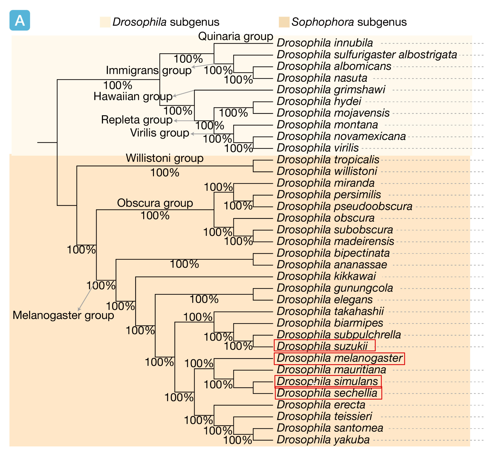
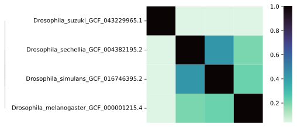
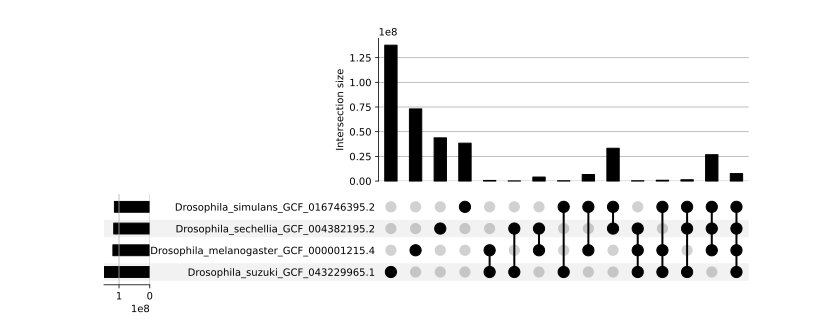
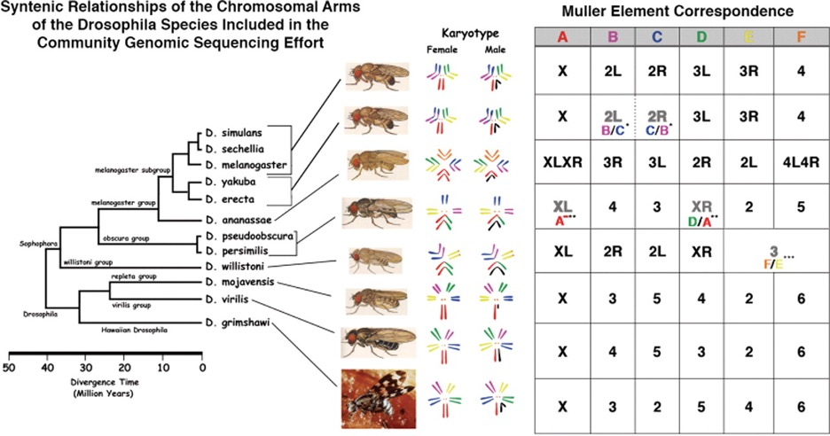

## Logging into the Machine

```{r}
#| label: setup
#| echo: false

knitr::opts_knit$set(root.dir = getwd())
```

After you log in to the server check if you have the folder "data" present in your home directory. You will be working in groups of 3. In this tutorial we will be running software on the server using the files in the data folder and then looking at the output by looking at the figures embedded in this markdown.

If you would like to look at the figures you generated or if you would like to run the R code copy the files to your computer like so:

```{bash, eval = FALSE}
scp -r <your_username>@212.189.205.230:~/zajac/data <your_dir>

scp <your_username>@212.189.205.230:~/<path-to-generated-file> .
```

## Learning objectives

In this tutorial, we will take a more in-depth look at the genome assemblies that will be used to build the pangenome graph. Specifically, we want to know:

-   how many chromosomes each species has and what are their genome sizes,

-   how much divergence exists between them,

-   what types of rearrangements and structural variants can already be observed from pairwise alignments,

-   how repetitive the genomes are, and so what proportion consists of regions that are notoriously difficult to assemble and compare across species or individuals.

These exercises:

-   will help us make predictions about what to expect from a pangenome graph,

-   will show us whether the data can be partitioned before building a pangenome — an especially useful strategy when working with large genomes,

-   will help us understand why a pangenome graph is a useful tool, and why analysing variation within a set of genomes using reference-based methods can be limiting.

## 0. Data

The following phylogenetic tree of 35 Drosophila species is from [@zheng2026]

{width="401"}

We are working with 4 Drosophila genomes highlighted on the tree, whose genomes have been downloaded from NCBI.

```{r}
df = read.delim("../zajac/data/metadata", header = F, sep = " ")
colnames(df) = c("NCBI link", "Species", "PanSN-spec")
knitr::kable(df[,c(2,3,1)])
```

We relabeled chromosomes according to the PanSN-spec nomenclature:

<https://github.com/pangenome/PanSN-spec>

```         
[sample_name][delim][haplotype_id][delim][contig_or_scaffold_name]
```

This will make our lives easier when building a pangenome.

### Questions

We know *Drosophila melanogaster* and *Drosophila simulans* diverged about 2-3 million years ago. Looking at the species relatedness on the phylogenetic tree - how similar or different do you expect them to be in terms of genomic architecture and composition? Discuss.

Now we will go through a series of metrics to see if your predictions were true.

## 1. Composition Similarity - How similar are genomes overall?

We will now use PanKmer to quantify genome composition similarity.

PanKmer [@aylward2023] is a tool for generating and analyzing *k*-mer indexes across an entire collection of genomes across one or more species. *k*-mers are nucleotide sequences of a given length *k*. The pangenome can be efficiently represented by a *k*-mer index which comprises a list of all unique *k*-mers observed across the population together with a table indicating presence or absence of each *k*-mer in each individual genome.

First, the user has to build a *k*-mers index for each genome. I have already done that for you. You will now build an adjacency matrix of *k*-mers similarity and then compute a Jaccard Similarity Index between each pair of genomes. You will then visualise the index in the form of a heatmap. Subsequently you will compute the exact overlap in k-mers between genomes which you will visualise using an upset plot.

Jaccard Similarity Index - a statistical measure used to quantify how similar two sets are.

In the command line run the code below to do so. The k-mer length used for the analysis is 25bp.

``` bash
mkdir pankmer

cd pankmer

conda activate pangenomics

pankmer adj-matrix -i ../zajac/data/pankmer/Drosophila_index.tar -o Drosophila_index_adj_matrix.csv

pankmer clustermap -i Drosophila_index_adj_matrix.csv --metric jaccard -o Drosophila_jaccard.svg

pankmer upset -i ../zajac/data/pankmer/Drosophila_index.tar -o Drosophila_index_upset.svg -g Drosophila_melanogaster_GCF_000001215.4 Drosophila_simulans_GCF_016746395.2 Drosophila_sechellia_GCF_004382195.2 Drosophila_suzuki_GCF_043229965.1
```

Lets look at the plots you generated. You can copy the plots to your computer or just have a look at the ones below.

First one shows the Jaccard Similarity Index.

<details class="image-toggle">

<summary>📷 Show plot</summary>



</details>

Lets also look at the exact overlaps in k-mers:

<details class="image-toggle">

<summary>📷 Show plot</summary>



</details>

### Questions

What are your conclusions? Which two species are most similar? What is the range of Jaccard Similarity Index? Which species is most distinct? Is this concordant with the phylogeny?

## 2. Alignments - How well do genomes map to each other?

So we already know the species differ quite a bit. Lets have a look how that divergence affects quality of pairwise alignments. I used minimap2 to map all genomes to *Drosophila melanogaster* as a reference and then to *Drosophila suzuki* as a reference. The mapping was done in the following way and the stats were obtained with paftools (DON'T RUN):

``` bash
minimap2 -x asm20 -c --eqx --secondary=no
k8-1.2/k8-x86_64-Linux paftools.js stat
```

The paf statistics are in data/paf_stats (```ls ../zajac/data/paf_stats``` if you want to check). Lets look at the percentage of each genome that actually mapped.

::: {.callout-tip collapse="true" icon = "false" appearance="simple"}

### Plots

```{r}

library(tidyverse)
library(dplyr)

all = NULL
for (i in list.files("../zajac/data/paf_stats/", pattern = "paf.stats")){
  name = str_remove(i, ".paf.stats")
  df = read.delim(paste0("../zajac/data/paf_stats/", i), sep = ":", header = F)
  all = rbind(all, data.frame("comparison" = name, "mapping_rate" = df[c(6),]$V2 * 100/df[c(5),]$V2))
}
all = all %>% separate(comparison, into = c("target", "query"), sep = "_")

ggplot(all,aes(target, query, fill= mapping_rate)) + 
  geom_tile() + 
  theme_bw() + 
  scale_fill_viridis_c() + 
  geom_text(aes(label = round(mapping_rate, 2)), colour = "red") 
```

:::

### Questions

What is your main conclusion? Do you observe any difference in which genome you use as a reference? How do the values compare to the PanKmer estimations of genome similarity? Why do you think that is?

## 3. Synteny conservation/Structural similarity - Are chromosomes structurally conserved?

Lets compare the orgnaization of the genomes using synteny analysis. For this we will ntSynt [@coombe2025], a scalable utility for computing large-scale and multi-genome macrosynteny blocks.

``` bash
cd ..

mkdir ntsynt

cd ntsynt

conda activate pangenomics #if you deactivated it previously

ntSynt -d 15 ../zajac/data/Drosophila*.fasta #this might take at most 10min

genome_to_colour=$(head -n1 ntSynt.k24.w1000.synteny_blocks.tsv | cut -f2) 

python ../ntSynt/visualization_scripts/format_blocks_gggenomes.py --blocks ntSynt.k24.w1000.synteny_blocks.tsv -p ggggenomes_viz --colour $genome_to_colour --fai *.fai
```

Run some statistics. Have a look at the column Average_coverage.

``` bash
python ../ntSynt/analysis_scripts/denovo_synteny_block_stats.py --tsv ntSynt.k24.w1000.synteny_blocks.tsv --fai *.fai
```

Now the code below will help you visualize the synteny. If you downloaded the data folder the ggggenomes_viz.sequence_lengths.tsv and ggggenomes_viz.links.tsv are in data/ntsynt/ and you can use the code below to visualise it on your own in R.

::: {.callout-tip collapse="true" icon = "false" appearance="simple"}

### Plots

```{r}
#| message: false
#| warning: false
#| fig-height: 10
#| fig-width: 25
library(Biostrings)
library(reshape2)
library(tidyverse)
library(dplyr)
library(ezRun)
library(gggenomes)
library(gtools)
library(scales)
library(ggthemr)
library(ggplot2)
library(ggh4x)

args = NULL
args$sequences = "../zajac/data/ntsynt/ggggenomes_viz.sequence_lengths.tsv"
args$links = "../zajac/data/ntsynt/ggggenomes_viz.links.tsv"
args$scale = 10000 #scale bar can be changed

# Read in and prepare sequences
sequences <- read.csv(args$sequences, sep = "\t", header = TRUE)
input_order <- unique(sequences$bin_id)
sequences$bin_id = factor(sequences$bin_id, levels = input_order)
sorted_names <- unique(sequences$seq_id)
input_chrom_order <- sorted_names
mixedrank <- function(x) order(gtools::mixedorder(x))
sequences <- sequences %>%
  arrange(factor(bin_id, levels=input_order), factor(seq_id, levels=input_chrom_order))

# Read in and prepare synteny links
links_ntsynt <- read.csv(args$links,
                         sep = "\t", header = TRUE)
links_ntsynt$seq_id <- factor(links_ntsynt$seq_id,
                              levels = mixedsort(unique(links_ntsynt$seq_id)))
links_ntsynt <- links_ntsynt[mixedorder(links_ntsynt$seq_id), ]
links_ntsynt$seq_id2 <- as.character(links_ntsynt$seq_id2)
links_ntsynt$colour_block <- as.factor(links_ntsynt$colour_block)
links_ntsynt$colour_block <- str_remove(links_ntsynt$colour_block, "DroMel#1#")
links_ntsynt$colour_block = factor(links_ntsynt$colour_block, levels = unique(links_ntsynt$colour_block))

# Prepare scale bar data frame
scale_bar <- tibble(x = c(0), xend = c(args$scale),
                    y = c(0), yend = c(0))

# Infer best units for scale bar
label <- paste(args$scale, "bp", sep = " ")
if (args$scale %% 1e9 == 0) {
  label <- paste(args$scale / 1e9, "Gbp", sep = " ")
} else if (args$scale %% 1e6 == 0) {
  label <- paste(args$scale / 1e6, "Mbp", sep = " ")
} else if (args$scale %% 1e3 == 0) {
  label <- paste(args$scale / 1e3, "kbp", sep = " ")
}

num_colours <- length(unique(links_ntsynt$colour_block))
p <-  gggenomes(seqs = sequences, links = links_ntsynt)
plot <- p + theme_gggenomes_clean(base_size = 15) +
  geom_link(aes(fill = colour_block), offset = 0, alpha = 0.5, size = 0.05) +
  geom_seq(size = 2, colour = "grey") + # draw contig/chromosome lines
  geom_seq_label(aes(label = seq_id), vjust = 1.1, size = 6) + # Can add seq labels if desired
  theme(axis.text.x = element_text(size = 25),
        legend.position = "bottom",
        legend.text = element_text(size = 9)) +
  scale_fill_manual(values = hue_pal()(num_colours),
                    breaks = unique(links_ntsynt$colour_block)) +
  scale_colour_manual(values = c("red")) +
  guides(fill = guide_legend(title = "", ncol = 10),
         colour = guide_legend(title = ""))

plot
```

:::

From Flybase:The Muller element designation is a notation used to standardize the names of the chromosomal arms in different species of *Drosophila*. The names of chromosomes and their arms were arbitrarily assigned as *Drosophila* researchers began to work with other species of *Drosophila*. Beginning in the late 1930s, Sturtevant, Tan, and Novitski used comparative genetic mapping studies in a variety of species to show that the chromosomal arms of these species had similar gene content and hypothesized that the genes were syntenic ([@sturtevant1941]). Muller ([1940](https://flybase.org/reports/FBrf0005055.html)) proposed a nomenclature system of six elements A to F as a standardized notation for the conserved chromosome arms among species that were later named in his honor as Muller elements (see the Table below). The 12 genomes study has largely confirmed that the genes of the six Muller elements are conserved among species, with some exceptions noted below ([@schaeffer2008], [@crosby2007]).

{width="612"}

### **Questions**

-   How much and what type of rearrangements between species do you see? Do they all have the same number of chromosomes? What is the average genome length that is covered by syntenic blocks?

-   Does your analysis show correspondence between Muller Elements between *D. melanogaster, D.sechellia* and *D. simulans*? Using the table below and your synteny analysis can you assign *Drosophila suzuki* chromosomal arms into Muller elements?

## 4. Quantifying Structural Variation

Lets use SYRI to quantify the amount of syntenic and nonsyntenic regions and to see what type of variation and what types of rearragments we can expect (large structural variants or rather mostly small indels and SNPs).

::: {.callout-tip collapse="true" icon = "false" appearance="simple"}

### Plots

```{r}
#| message: false
#| warning: false
#| fig-height: 10
#| fig-width: 13

library(cowplot)
library(patchwork)
library(reshape2)

synteny = NULL
variants = NULL
syri_summary_files = list.files("../zajac/data/syri/", patter = "summary")
n=1
for (i in syri_summary_files){
  query = sapply(str_split(str_remove(i, "syri.summary"), "_"), .subset, 2)
  df = read.delim(paste0("../zajac/data/syri/", i), sep = "\t", header = F)
  df1 = df[df$V1 %in% c("Syntenic regions", "Not aligned (reference)", "Not aligned (query)"),]
  df1 = df1[,-2]
  df1$V1 = c("Syntenic regions", "Not aligned", "Not aligned")
  colnames(df1) = c("cat", "DroMel#1", query)
  df1 = df1 %>% reshape2::melt(id.vars = "cat") %>% filter(value != "-") %>% mutate(comp = n)
  df2 = df[df$V1 %in% c( "SNPs", "Insertions", "Deletions"),]
  df2 = df2[,-2]
  colnames(df2) = c("variant_type", "DroMel#1", query)
  df2 = df2 %>% reshape2::melt(id.vars = "variant_type") %>% filter(value != "-") %>% mutate(comp = n)
  synteny = rbind(df1,synteny)
  variants = rbind(df2,variants)
  n = n+1
}

p1 = ggplot(synteny, aes(variable, as.numeric(value)/1000000, fill = cat)) + geom_col() + facet_grid(~comp, space = "free", scales = "free") + theme_bw() + labs(y = "Length (Mbp)", x = "species compared", fill = "category") + ggtitle("Alignment") + theme(text = element_text(size = 15))

p2 = ggplot(variants, aes(variable, as.numeric(value)/1000000, fill = variant_type)) + geom_col(position = "dodge") + facet_grid(~comp, space = "free", scales = "free") + theme_bw() + labs(y = "Length (Mbp)", x = "species compared", fill = "category") + ggtitle("Variants") + theme(text = element_text(size = 15))

p1/p2
```

:::

### Questions

Why are there so few variants observed between *Drosophila melanogaster* and *Drosophila suzuki*?

## 5. Repeats and Transposable Elements - how much of the complexity is due to them

In order to understand if the poor mapping quality or the low genome composition similarity is due to repetitive content of the genome I annotated repeats with RepeatModeler and RepeatMasker. I ran the following code for you already (DON'T RUN):

``` bash
singularity exec --cleanenv dfam-tetools-latest.sif BuildDatabase -name ${name}.db data/${name}.fasta # Build the database

singularity exec --cleanenv dfam-tetools-latest.sif RepeatModeler -database ${name}.db >& repeats/${name}.db.masked.out # Run RepeatModeler

singularity exec --cleanenv dfam-tetools-latest.sif RepeatMasker -pa 15 -lib ${name}.db-families.fa -xsmall -gff -s -no_is -cutoff 255 -frag 20000 ${name}.fasta # Run RepeatMasker
```

Here we compare the output.

```{r}
#| message: false
#| warning: false
#| fig-height: 10
#| fig-width: 20


files_fai = list.files("../zajac/data/", pattern = "fai")
genomes_sizes = lapply(files_fai, function(x){tail(read.delim(paste0("../zajac/data/",x), header = F), n= 1)$V3})
names(genomes_sizes) = files_fai
genomes_sizes = data.frame(genomes_size = t(as.data.frame(genomes_sizes)))
genomes_sizes$genome = str_remove(rownames(genomes_sizes), ".fai")

df = read.delim("../zajac/data/repeats.txt", sep = "\t")

df = merge(genomes_sizes, df, by = "genome")

df$genome = paste0(sapply(str_split(df$genome, "_"), .subset, 1), " ", sapply(str_split(df$genome, "_"), .subset, 2))

p1 = ggplot(df, aes(genome,genomes_size )) + geom_col() + theme_bw() + theme(text = element_text(size = 18), axis.text.x = element_text(angle = 45, hjust = 1, vjust = 1))
p2 = ggplot(df, aes(genome,perc_bases_masked )) + geom_col() + theme_bw() + theme(text = element_text(size = 18), axis.text.x = element_text(angle = 45, hjust = 1, vjust = 1))
p3 = ggplot(df, aes(genome,GC )) + geom_col() + theme_bw() + theme(text = element_text(size = 18), axis.text.x = element_text(angle = 45, hjust = 1, vjust = 1))

p1 + p2 + p3
```

### Questions

What patterns do you observe? Do you think repeats and transposable elements contribute to genome complexity in Drosophila?

## 6. BONUS: Exploration of specific genomic regions - microsynteny and genome sequence complexity

Lets look at the mapping of the sex chromosome between the 4 species using SVbyEye which is an R package that helps visualize paf alignments.

::: {.callout-tip collapse="true" icon = "false" appearance="simple"}

### Plots

```{r}
library(SVbyEye)
paf.table = NULL
for (i in list.files("../minimap2/chrX/", pattern = "DroMel#1#X_", full.names = T)){
  paf = readPaf(i)
  paf.table = rbind(paf,paf.table)
}

plotAVA(
    paf.table = paf.table, color.by = "direction", seqnames.order = c("DroSech#1#X","DroMel#1#X", "DroSim#1#X")
)
```

```{r}

plotAVA(
    paf.table = paf.table, color.by = "direction", seqnames.order = c("DroSuz#1#X","DroMel#1#X", "DroSim#1#X")
)

```

:::

### Questions

Which species have most similar X chromosome structure?

Which species has the largest X chromosome?

## Conclusions

Main takeaways:

1\. Reference-based approaches lose information on highly divergent regions.

2\. The more phylogenetically distant species are, the more genomic divergence one can expect.

3\. To build a pangenome one could partition the data into chr2L, chr2R, chr3, chr4 and chrX - there seems to be no interchromosomal translocations.

4\. Drosophila suzuki is the most divergent species from this set and has the highest proportion of repetitive content - it will be a species causing the greatest increase in pangenome size

... Anything you would add?
