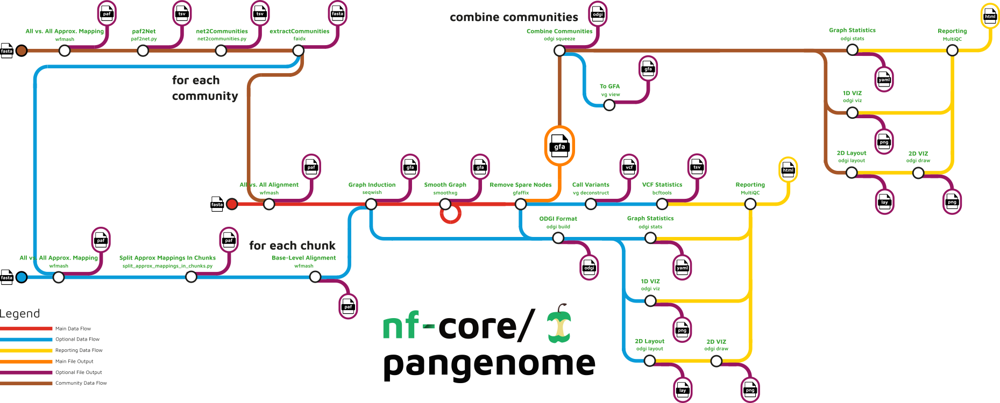
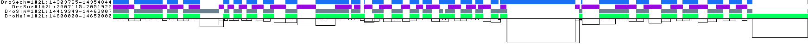
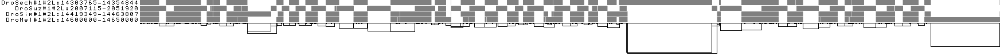
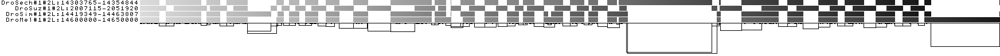
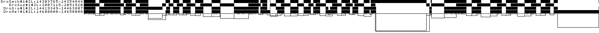
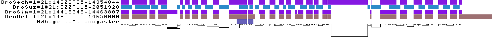
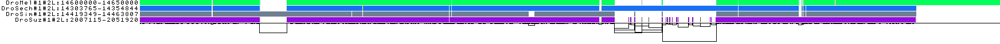

## Learning objectives

In this tutorial we will aim to:

-   construct a simple variation graph with vg

-   undrstand a gfa file format

-   construct a more complex graph with PGGB

-   test multiple different PGGB parameters and understand their effects on the pangenome graph structure

-   evaluate quality of the graph using a few metrics

## 1. Constructing a graph using vg

In this exercise we will construct a tiny pangenome variation graph with vg construct. vg is a tool suite for working with variation graphs. It is very useful for a variety of functions e.g. variant calling from pangenome graphs or mapping short reads to pangenome graphs. Have a look at the [github page](https://github.com/vgteam/vg) for more information.

We will construct a graph from a sequence in fasta file format and then inject a set of variants in a VCF format that will be inserted into the graph as additional nodes.

``` bash
mkdir vg 

cd vg

conda activate pangenomics

singularity exec --bind=/disk/shared/zajac/data/ /disk/shared/pggb.sif vg construct -r ../zajac/data/vg/tiny.fasta -v ../zajac/data/vg/tiny.vcf.gz > tiny.vg
```

Lets visualise this graph. Run both of these commands below. The difference between them is only -S.

``` bash
singularity exec --bind=/disk/shared/zajac/data/ /disk/shared/pggb.sif vg view -dp tiny.vg | dot -T jpeg -o tiny.sequences.jpeg

singularity exec --bind=/disk/shared/zajac/data/ /disk/shared/pggb.sif vg view -dpS tiny.vg | dot -T jpeg -o tiny.sequence_lengths.jpeg
```

Copy the graph visualisations to your local computer:

``` bash
scp <your_username>@212.189.205.230:~/<path-to-generated-file> .
```

### Questions

Ok lets break down what you see - the nodes are sequences, the links connect the sequences. Both the reference sequence and the variants are present in the graph, the top line indicates which nodes make up the reference (tiny.fasta) and the nodes that are not mentioned on that line are the variants.

What is the difference between the two graphs you visualized?

Why are some sequences broken down into separate nodes even though there are no variants between them - how long are these nodes? why do you think that is? To get an idea run and look at the different parameters are the defaults for those parameters:

``` bash
singularity exec --bind=/disk/shared/zajac/data/ /disk/shared/pggb.sif vg construct -h
```

::: {.callout-tip collapse="true" icon = "false" appearance="simple"}

### Answers

On one of the graph visualisations all nodes have the actually sequences displayed, on the other only the length of nodes is displayed.

The -m parameters specifies a limit the maximum allowable node sequence size (default: 32). All nodes are maximum 32bp long.

:::

## 2. GFA file format.

Now lets convert our tiny graph into a gfa file, the type of file format the pggb graph comes in. With the commands below you create and also display the file.

``` bash
singularity exec --bind=/disk/shared/zajac/data/ /disk/shared/pggb.sif vg view tiny.vg > tiny.gfa

cat tiny.gfa
```

### Questions

Have a look at the structure of this file. Each line is a separate record of some part of the graph. The lines come in several types, which are indicated by the first character of the line. What line types do you see? What do you think they indicate? Here you will find [GFA](https://github.com/GFA-spec/GFA-spec/blob/master/GFA1.md) files explained.

Lets look at the P line - can you explain the exact structure of this line? What would you expect if you had a pangenome built from several different sequences?

::: {.callout-tip collapse="true" icon = "false" appearance="simple"}

### Answers

You should see the following line types:

-   `H`: a header.

-   `S`: a "sequence" line, which is the sequence and ID of a node in the graph.

-   `L`: a "link" line, which is an edge in the graph.

-   `P`: a "path" line, which labels a path of interest in the graph. In this case, the path is the walk that the reference sequence takes through the graph. It should be noted, however, that the format does not specify that these lines come in a particular order.

If the graph was built from multiple seqeunces, it would have multiple P lines.

:::

## 3. PanGenome Graph Builder

To built a "real" pangenome graph we will now use a subset of sequences from our previous Drosophila dataset. We will be using a 40kb region on chromosome 2L within which there is a gene coding for Alcohol dehydrogenase. Alcohol dehydrogenase is an interesting enzyme whose activity has been show to differ between species that feed of and breed in fermented, rotten fruit (*Drosophila simulans, Drosophila melanogaster*) and species that feed and breed exclusively on ripe fruit (*Drosophila suzuki*).

First lets have a look at the parameters that one can specify with pggb for building a pangenome graph:

``` bash
singularity exec --bind=/disk/shared/zajac/data/ /disk/shared/pggb.sif pggb -h
```

### 3A. In-depth look at the parameters.

Lets pay attention to a few of them.

So to recall pggb runs the following steps:



Look at the red line - the first step is an all-to-all alignment with wfmash. Secondly there is a graph induction with seqwish and the final step performed with smoothxg is when the graph is linearized and simplified using blocked partial order alignment (POA). Lets focus on these three steps.

#### i. All-to-all alignment.

Two parameters are essential for defining the structure of the pangenome and are implemented in the first step (wfmash all-to-all mapping):

--segment-length - default 5kb

--map-pct-id - default 90%

Segment length defines the length of the mapped and aligned segments, provides a kind of minimum alignment length filter. The mashmap step in wfmash will only consider segments of this size, and require them to have an approximate pairwise identity of at least --map-pct-id.

#### ii. Graph induction

Next you have a set of parameters defined at the step of graph induction which is performed with seqwish.

--min-match-len - which is set by default to 23

The min-match-len sets a filter for exact matches below this length during graph induction. The default setting of -k 23 is optimal up to around 5% divergence, and the authors suggest lowering it for higher divergence and increasing it for lower divergence. E.g. values up to -k 79 work well for human haplotypes. In effect, setting -k to N means that we can tolerate a local pairwise difference rate of no more than 1/N.

#### iii. Graph ordering and simplification.

Finally you have a set of parameters defined at the step run with smoothxg:

--poa-length-target - it specifies the target sequence length for the partial order alignment. The default is 700,1100 which means two rounds of normalization are performed first using target length of 700bp and next of 1100bp.

--n-haplotypes - number of haplotypes you expect from the graph

#### iv. Output

Then you have a set of parameters where you can specify what you want as the output:

--skip-viz - don't render visualizations of the graph in 1D and 2D \[default: make them\]

-S, --stats - generate statistics of the seqwish and smoothxg graph \[default: off\]

-m, --multiqc - generate MultiQC report of graphs' statistics and visualizations, automatically runs odgi stats \[default: off\]

These are generated with odgi.

### 3B. Building a graph.

Now we are ready to build our own graph. Lets start with everything set to default but include -S for printing graph statistics.

``` bash
cd .. #if you are still within the vg directory

mkdir pggb

cd pggb

singularity exec --bind=/disk/shared/zajac/data/ /disk/shared/pggb.sif pggb -i ../zajac/data/pggb/Adh_chr2L.fasta -n 4 -t 16 -o Adh_pggb_default -S
```

#### 3Bi. Default parameters.

##### Questions

Why did we set -n to 4? What is the size of the graph and how many nodes and edges does it have?

Lets start filling out the following table - best if you create an excel table of your own and start filling it out on your own computer:

| Run | Segment Length | Pairwise identity | Minimum match length | POA Length target | Length of the graph | Number of nodes | Number of edges |
|---------|---------|---------|---------|---------|---------|---------|---------|
| 1 | 5000 | 90 | 23 | 700,1100 |  |  |  |

: PGGB runs results

::: {.callout-tip collapse="true" icon = "false" appearance="simple"}

##### Answers

| Run | Segment Length | Pairwise identity | Minimum match length | POA Length target | Length of the graph | Number of nodes | Number of edges |
|---------|---------|---------|---------|---------|---------|---------|---------|
| 1 | 5000 | 90 | 23 | 700,1100 | 89425 | 11024 | 15132 |

: PGGB runs results

Note your results will not be the same as my results. Re running smoothxg will generate a slightly different version of the graph. This is due to stochastic parallel sorting of the graph before blocks are selected for the multiple sequence alignment to be applied. Re-running smoothxg will almost always render a very slightly different result due to the inherent randomness.

:::

#### 3Bii. Map-pct-id

So we know from our previous analysis that *Drosophila suzuki* differs from other species by a lot more than 10%. Perhaps that has an influence on the alignment in this genomic region or maybe the divergence is actually 10%.

Lets change the pairwise identity to 60%.

``` bash
singularity exec --bind=/disk/shared/zajac/data/ /disk/shared/pggb.sif pggb -i ../zajac/data/pggb/Adh_chr2L.fasta --map-pct-id 60 -n 4 -t 16 -o Adh_pggb_p60 -S
```

##### Questions

What do you observe? What is your conclusion - should we stick with 60% or go with 90%?

| Run | Segment Length | Pairwise identity | Minimum match length | POA Length target | Length of the graph | Number of nodes | Number of edges |
|---------|---------|---------|---------|---------|---------|---------|---------|
| 1 | 5000 | 60 | 23 | 700,1100 |  |  |  |

::: {.callout-tip collapse="true" icon = "false" appearance="simple"}

##### Answers

| Run | Segment Length | Pairwise identity | Minimum match length | POA Length target | Length of the graph | Number of nodes | Number of edges |
|---------|---------|---------|---------|---------|---------|---------|---------|
| 1 | 5000 | 90 | 23 | 700,1100 | 89425 | 11024 | 15132 |
| 2 | 5000 | 60 | 23 | 700,1100 | 89391 | 10927 | 14996 |

: PGGB runs results

The structure of the graph changed minimally so it appears the p equals to 90% was already a good choice. Lets stick with that then.

:::

#### 3Biii. Segment-length.

Now lets start changing the length of the mapped and aligned segments, lets test a much smaller segment length of 100bp, 500bp and then lets go with one twice and four times as much as the default - 10,000bp and 20,000bp.

Use the command below but make sure to change the parameters in \<\>.

``` bash
for i in 100 500 10000 20000; 
do 
  singularity exec --bind=/disk/shared/zajac/data/ /disk/shared/pggb.sif pggb -i ../zajac/data/pggb/Adh_chr2L.fasta --segment-length $i -n 4 -t 16 -o Adh_pggb_s${i} -S; 
done
```

##### Questions

Fill out the table! How did that affect graph statistics? What is the difference between graphs built using the smaller and the larger segment lengths relative to the default? Why do you think that is?

| Run | Segment Length | Pairwise identity | Minimum match length | POA Length target | Length of the graph | Number of nodes | Number of edges |
|---------|---------|---------|---------|---------|---------|---------|---------|
| 3 | 100 | 90 | 23 | 700,1100 |  |  |  |
| 4 | 500 | 90 | 23 | 700,1100 |  |  |  |
| 5 | 10000 | 90 | 23 | 700,1100 |  |  |  |
| 6 | 20000 | 90 | 23 | 700,1100 |  |  |  |

::: {.callout-tip collapse="true" icon = "false" appearance="simple"}

##### Answers

| Run | Segment Length | Pairwise identity | Minimum match length | POA Length target | Length of the graph | Number of nodes | Number of edges |
|---------|---------|---------|---------|---------|---------|---------|---------|
| 1 | 5000 | 90 | 23 | 700,1100 | 89425 | 11024 | 15132 |
| 2 | 5000 | 60 | 23 | 700,1100 | 89391 | 10927 | 14996 |
| 3 | 100 | 90 | 23 | 700,1100 | 101444 | 7917 | 10869 |
| 4 | 500 | 90 | 23 | 700,1100 | 92449 | 10340 | 14198 |
| 5 | 10000 | 90 | 23 | 700,1100 | 89816 | 10913 | 14982 |
| 6 | 20000 | 90 | 23 | 700,1100 | 89846 | 10846 | 14885 |

: PGGB runs results

The graphs with smaller segment length are greater in length than graphs with greater segment length.

If you keep identity fixed at 90%:

with -s 100, an alignment needs 90 matching bp within a 100 bp segment, with -s 10000, it needs 9000 matching bp across the entire segment.

So smaller segment lengths increase alignment sensitivity and create a more fragmented graph.

:::

#### 3Biv. Segment-length + map-pct-id

Lets try decreasing percentage identity for the graphs with smaller segment length (100 and 500 bp), lets try 60%.

``` bash
for i in 100 500; 
do 
  singularity exec --bind=/disk/shared/zajac/data/ /disk/shared/pggb.sif pggb -i ../zajac/data/pggb/Adh_chr2L.fasta --segment-length $i --map-pct-id 60 -n 4 -t 16 -o Adh_pggb_s${i}_p60 -S; 
done
```

##### Questions

Do you see any change?

| Run | Segment Length | Pairwise identity | Minimum match length | POA Length target | Length of the graph | Number of nodes | Number of edges |
|---------|---------|---------|---------|---------|---------|---------|---------|
| 7 | 100 | 60 | 23 | 700,1100 |  |  |  |
| 8 | 500 | 60 | 23 | 700,1100 |  |  |  |

::: {.callout-tip collapse="true" icon = "false" appearance="simple"}

##### Answers

| Run | Segment Length | Pairwise identity | Minimum match length | POA Length target | Length of the graph | Number of nodes | Number of edges |
|---------|---------|---------|---------|---------|---------|---------|---------|
| 1 | 5000 | 90 | 23 | 700,1100 | 89425 | 11024 | 15132 |
| 2 | 5000 | 60 | 23 | 700,1100 | 89391 | 10927 | 14996 |
| 3 | 100 | 90 | 23 | 700,1100 | 101444 | 7917 | 10869 |
| 4 | 500 | 90 | 23 | 700,1100 | 92449 | 10340 | 14198 |
| 5 | 10000 | 90 | 23 | 700,1100 | 89816 | 10913 | 14982 |
| 6 | 20000 | 90 | 23 | 700,1100 | 89846 | 10846 | 14885 |
| 7 | 100 | 60 | 23 | 700,1100 | 94016 | 9798 | 13454 |
| 8 | 500 | 60 | 23 | 700,1100 | 89042 | 11149 | 15320 |

: PGGB runs results

The graphs decreased in size and are now more similar to those of segment-length of 5 or 10kb and the divergence of 90%.

:::

#### 3Bv. Poa-length-target

Lets now modify the last parameter, lets run more rounds of normalization and increase the target sequence length for the partial order alignment. Lets do that for the graphs created with 500bp (60% map_pct_id) and 10,000bp segment length (90% map_pct_id). Why would I choose those two?

By default poa target length is set to 700 and 1100bp. Lets increase that and lets carry out 4 rounds of normalization.

``` bash
singularity exec --bind=/disk/shared/zajac/data/ /disk/shared/pggb.sif pggb -i ../zajac/data/pggb/Adh_chr2L.fasta --segment-length 10000 --map-pct-id 90 -G 1400,1600,2000,2200 -n 4 -t 16 -o Adh_pggb_s10000_G4 -S

singularity exec --bind=/disk/shared/zajac/data/ /disk/shared/pggb.sif pggb -i ../zajac/data/pggb/Adh_chr2L.fasta --segment-length 500 --map-pct-id 60 -G 1400,1600,2000,2200 -n 4 -t 16 -o Adh_pggb_s500_G4 -S
```

##### Questions

How does that effect graph statistics? How did that effect run time?

| Run | Segment Length | Pairwise identity | Minimum match length | POA Length target | Length of the graph | Number of nodes | Number of edges |
|---------|---------|---------|---------|---------|---------|---------|---------|
| 7 | 5000 | 90 | 23 | 1400,1600,2000,2200 |  |  |  |
| 8 | 10000 | 90 | 23 | 1400,1600,2000,2200 |  |  |  |

::: {.callout-tip collapse="true" icon = "false" appearance="simple"}

##### Answers

| Run | Segment Length | Pairwise identity | Minimum match length | POA Length target | Length of the graph | Number of nodes | Number of edges |
|---------|---------|---------|---------|---------|---------|---------|---------|
| 1 | 5000 | 90 | 23 | 700,1100 | 89425 | 11024 | 15132 |
| 2 | 5000 | 60 | 23 | 700,1100 | 89391 | 10927 | 14996 |
| 3 | 100 | 90 | 23 | 700,1100 | 101444 | 7917 | 10869 |
| 4 | 500 | 90 | 23 | 700,1100 | 92449 | 10340 | 14198 |
| 5 | 10000 | 90 | 23 | 700,1100 | 89816 | 10913 | 14982 |
| 6 | 20000 | 90 | 23 | 700,1100 | 89846 | 10846 | 14885 |
| 7 | 100 | 60 | 23 | 700,1100 | 94016 | 9798 | 13454 |
| 8 | 500 | 60 | 23 | 700,1100 | 89042 | 11149 | 15320 |
| 9 | 500 | 60 | 23 | 1400,1600,2000,2200 | 92072 | 10758 | 14785 |
| 10 | 10000 | 90 | 23 | 1400,1600,2000,2200 | 92453 | 10673 | 14669 |

: PGGB runs results

The graphs are more compact, have fewer nodes and fewer edges and the file size is smaller but the graphs increase in length. smoothxg repeatedly breaks graph regions into POA blocks and realigns them. Initial induction sometimes over-aligns repeats or weak homologies. Later normalization rounds may “undo” some of those merges when they are inconsistent across paths. A graph that is easier to linearize, sort, or genotype against often requires more explicit structure. PGGB optimization is usually targeting alignment consistency and local ordering, not minimum graph size.

:::

#### 3Bvi. Visualisations of your graphs.

Now lets have a look at all the visualizations. They are all created with odgi viz. Here I show the default parameters graph with 4 rounds of normalization. If you would like to look at the graph structure of the any of the graphs you created, copy the visualisations in png onto your computer with scp.

The default associates a color with each path. This is stable across different runs of odgi viz. (viz_multiqc.png)

{width="676"}

We also have a view that shows the "self depth" across the graph. In this case there are no looping paths, so the color is always gray=1x. (viz_depth_multiqc.png)



We can look at orientation of paths using two views.

One shows the "position" of each path relative to the graph. It runs light to dark from 0 to path length. As you can see all of the paths are positioned the same way relative to the graph (viz_pos_multiqc.png)



A similar view shows inverted regions of paths relative to the graph in red, while the forward orientation in black. In this region we do not observe any inversion. (viz_inv_multiqc.png)



And finally, a compressed view shows coverage across the pangenome coordinate space of all paths. It's a kind of heatmap. This helps when we have a lot of paths to consider (viz_O_multiqc.png)


And now lets look where the Adh genes is!




##### Questions

Do you see any inverted alignments in the graphs?

I created a graph for you from the multiple sequence alignment performed with MAFFT.

I first ran MAFFT and then I ran the following code. If you want you can run the commands yourself and create your own visualization. The data you need is in your folder data/MSA.fasta.

``` bash
singularity exec --bind=/disk/shared/zajac/data/ /disk/shared/pggb.sif vg construct --msa MSA.fasta > graph.vg
singularity exec --bind=/disk/shared/zajac/data/ /disk/shared/pggb.sif vg convert -f -W graph.vg > graph.gfa
singularity exec --bind=/disk/shared/zajac/data/ /disk/shared/pggb.sif odgi unchop -i graph.gfa -o - | singularity exec --bind=/disk/shared/zajac/data/ /disk/shared/pggb.sif odgi sort -i - -o - | singularity exec --bind=/disk/shared/zajac/data/ /disk/shared/pggb.sif odgi view -i - -g > graph.mod.gfa
singularity exec --bind=/disk/shared/zajac/data/ /disk/shared/pggb.sif odgi build -g graph.mod.gfa --sort -o graph.og 
singularity exec --bind=/disk/shared/zajac/data/ /disk/shared/pggb.sif odgi viz -i graph.og -o graph.png
```

Do you see a similarity in the structure of the graph and the MSA?



### 4. BONUS

Now that you have your table, you can keep on going and editing other parameters. In the end you can plot the graph lengths of graphs constructed with different parameter sets using R (ggplot2) and you can compare visualisations.

## Conclusions

1\. There are multiple different parameters that can impact the structure of the pangenome graph.

2\. To choose the best set of parameters you need to understand the structure/quality of the genomes you are working with.

3\. There are mutliple different ways to QC your graph:   

-   Compression ratio - a PGGB graph is lossless so the smaller the graph size relative to the input genomes, the better. Inadequate set of parameters can split same sequences into separate nodes and inflate the size of the graph. However, as you have seen smoothxg can increase the size of the graph while improving compactness and structure so this rule has to be applied with caution taking into account other graph metrics.

-   Alignment of BUSCO genes - while QCing the genome assembly you run BUSCO to check for benchmark single copy orthologs within your genome. You get a file of coordinates of those genes within your genome. Wfmash alignment can be QCed using those BUSCO gene coordinates - do single copy orthologs present across all sequences align well?

-   SNP sets - once you call variants in your pangenome using vg deconstruct you can compare the called variants with a truth set, a set of SNPs you know should be found. That is not always available for all species.

-   Use of external software - e.g. https://github.com/cumtr/PG-SCUnK

... Anything you would add?
