# impg II: pangenome queries with impg and syng

## Learning objectives

In this tutorial we will:

- query 235 yeast assemblies against the SGD reference using two different backends;
- compare a reference-based PAF view with an all-to-all syng view;
- extract small local pangenome graphs from interesting loci;
- scan 10 kb reference windows for pseudohomolog regions in subtelomeres;
- use the GFF to connect sequence-level pangenome patterns back to genes.

The point is not to produce a perfect final analysis. These tools are moving quickly, the syng backend is experimental, and some outputs will need interpretation. The useful part is seeing what each method makes easy, what it misses, and where it gives you suspicious results worth investigating.

## Biological background

This practical sits on two complete-genome yeast pangenome papers:

- Yue et al. 2017, "Contrasting evolutionary genome dynamics between domesticated and wild yeasts", introduced a complete-genome yeast pangenome and made subtelomeric variation, Y-prime/X elements, Ty-containing regions, and pseudohomolog regions visible in a way short-read assemblies could not. DOI: <https://doi.org/10.1038/ng.3847>
- O'Donnell, Yue et al. 2023, "Telomere-to-telomere assemblies of 142 strains characterize the genome structural landscape in *Saccharomyces cerevisiae*", introduced the Saccharomyces cerevisiae Reference Assembly Panel (ScRAP). This is the lineage of the 235 haplotypes used here. The paper is especially relevant for this tutorial because it shows that structural variation is strongly shaped by subtelomeres, Ty elements, telomere dynamics, horizontal transfer at chromosome ends, and other repeat-mediated chromosome-end processes. DOI: <https://doi.org/10.1038/s41588-023-01459-y>

The term "pseudohomolog region" is our teaching shorthand here. The 2023 ScRAP paper does not need that exact vocabulary to be relevant: its subtelomeric SVs, dispersed repeats, Ty/LTR-mediated rearrangements, X/Y-prime elements, tDNAs, and telomere-associated HGT are the biological substrate we are probing with quick `impg` queries.

<details>
<summary>Context figure: ScRAP structural variants concentrate toward chromosome ends</summary>

This is panel 2e from O'Donnell, Yue et al. 2023. Positions are scaled from centromere (`0`) to telomere (`1`), showing the chromosome-end enrichment that motivates the pseudohomolog region scan below.

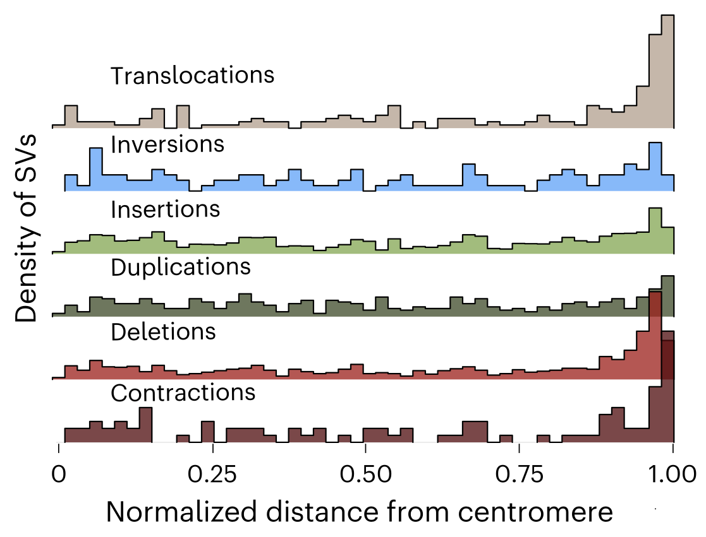

</details>

## Technical background: `impg`, syng, and syncmers

`impg` is a query tool for pangenome alignments and local pangenome graphs. In the first `impg` session, the index was built from whole-genome alignments. Here we use two views of the same 235 yeast haplotypes:

- a reference-based all-vs-SGD PAF file from `wfmash`, which is easy to reason about but only asks "what aligns to this reference interval?";
- a syng index, which is built from all assemblies together and lets `impg` ask for regions connected by shared sequence anchors without first choosing one reference alignment as the only coordinate system.

The syng integration in `impg` is ongoing work. The goal is to make all-to-all pangenome analyses feel like normal command-line interval queries: choose a source interval, ask what other sequences are connected to it, and then optionally render the result as BED, FASTA, GFA, VCF, or figures. That is why this tutorial asks you to compare the PAF and syng backends rather than declaring one answer "correct".

The underlying syng idea follows Richard Durbin's 2026 preprint on indexing paths through syncmer graphs with GBWT skiplists: <https://doi.org/10.64898/2026.03.26.714584>. The practical consequence for us is that a large collection of genomes can be represented as paths through a graph of selected sequence anchors, then queried quickly by walking from one path to nearby paths that share anchors.

Those anchors are **syncmers**, introduced by Edgar 2021: <https://doi.org/10.7717/peerj.10805>. A syncmer is a selected `k`-mer whose selection depends on the internal structure of the `k`-mer itself. For example, in a closed syncmer rule, a `k`-mer is selected when its smallest `s`-mer sits at the beginning or end of the `k`-mer. The useful property is synchronization: if the same selected `k`-mer occurs in two sequences, it is selected in both sequences. That makes syncmers attractive as sparse anchors for pangenome indexing.

In this dataset the prepared syng index uses these parameters:

```text
syncmer_length = 63
smer_length    = 8
syncmer_w      = 55
syncmer_seed   = 7
```

You do not need to tune these parameters during the practical. The query parameters you *will* change, such as `--syng-extension`, `--syng-seed-drop-top-fraction`, and `--syng-seed-walk-anchors`, control how aggressively `impg` expands and filters from the syncmer anchors it finds near your query interval.

<details>
<summary>Optional background: closed syncmers</summary>

Figure 1 of Edgar 2021 gives the cleanest visual introduction to closed syncmers. If you want to read the original explanation, open the paper through the DOI: <https://doi.org/10.7717/peerj.10805>.

Once the workshop image file is present, it can be shown here as:

```markdown

```

</details>

## 0. Setup on Vesuvio

Make sure the workshop tool directory is first on your `PATH`.

```bash
export PATH=/usr/local/bin:$PATH
```

If you will use more than one terminal, add this to your shell startup file:

```bash
echo 'export PATH=/usr/local/bin:$PATH' >> ~/.bashrc
source ~/.bashrc
```

If you are using `zsh`, use `~/.zshrc` instead:

```bash
echo 'export PATH=/usr/local/bin:$PATH' >> ~/.zshrc
source ~/.zshrc
```

Make a working directory first. Everything you create in this tutorial should live there.

```bash
mkdir -p ~/yeast-pangenome-tutorial
cd ~/yeast-pangenome-tutorial
```

Install any missing tools with Guix. Most of this should already be available on Vesuvio, but `guix install` is the normal pattern for the practicals.

```bash
guix install wfmash r-minimal r-ggplot2

# After a fresh install, either open a new terminal or source the profile once.
GUIX_PROFILE="$HOME/.guix-profile"
. "$GUIX_PROFILE/etc/profile"
unset GUIX_PROFILE
```

`odgi` may not be visible in the current Guix channel on this Vesuvio image. Try the normal install first:

```bash
guix install odgi
```

If Guix says `odgi: unknown package`, do not spend workshop time debugging that. The helper script below will look for a provided `odgi` binary in `/gnu/store`.

Now symlink the prepared files. Symlinks are faster and avoid copying several GB per group.

```bash

SOURCE=/home/erikg/yeast

ln -s ${SOURCE}/yeast235.fa.gz .
ln -s ${SOURCE}/yeast235.fa.gz.fai .
ln -s ${SOURCE}/yeast235.fa.gz.gzi .
ln -s ${SOURCE}/yeast235.agc .
ln -s ${SOURCE}/yeast235.gff.gz .
ln -s ${SOURCE}/yeast235.vs.SGDref.paf .
ln -s ${SOURCE}/yeast235.syng.* .

mkdir -p scripts results figures graphs
cp ${SOURCE}/scripts/paf_window_chrom_counts.awk scripts/
cp ${SOURCE}/scripts/syng_window_chrom_counts.sh scripts/
cp ${SOURCE}/scripts/plot_window_counts.R scripts/
cp ${SOURCE}/scripts/plot_paf_vs_syng.R scripts/
cp ${SOURCE}/scripts/query_locus_graphs.sh scripts/
cp ${SOURCE}/scripts/odgi_viz_gfas.sh scripts/
```

Check that the tools are visible.

```bash
command -v impg
command -v wfmash
command -v gfalook
command -v guix
command -v FastGA
command -v FAtoGDB
```

Check that R is now available:

```bash
Rscript --version
```

If `Rscript` works but cannot find `ggplot2`, source the Guix profile again:

```bash
GUIX_PROFILE="$HOME/.guix-profile"
. "$GUIX_PROFILE/etc/profile"
unset GUIX_PROFILE
```

### Data files

```bash
ls -lh yeast235.fa.gz yeast235.agc yeast235.gff.gz yeast235.vs.SGDref.paf
ls -lh yeast235.syng.*
```

The sequence names use PanSN-style names:

```bash
head yeast235.fa.gz.fai
awk '$1 ~ /^SGDref#0#/ {print $1, $2}' yeast235.fa.gz.fai
```

For example, `SGDref#0#chrV` is chromosome V in the SGD reference path.

<details>
<summary>Answer</summary>

The SGD reference has paths named `SGDref#0#chrI` through `SGDref#0#chrXVI`, plus `SGDref#0#chrMT`. Other assemblies have names like `AAA#0#chrV` or fragmented contigs such as `CFF#2#chrII_3`.

</details>

## 1. How the reference-based PAF was made

The all-vs-reference PAF has already been computed. Do not run this during the practical unless the instructor asks you to. On 16 threads it takes roughly 15-20 minutes and many groups running it together will waste the machine.

```bash
wfmash -t 16 -p 95 -T SGDref yeast235.fa.gz > yeast235.vs.SGDref.paf
```

Look at the first few records:

```bash
head -5 yeast235.vs.SGDref.paf | cut -f 1-12
```

PAF columns 1-4 describe the query interval. Columns 6-9 describe the target interval. Here the target is the SGD reference because `-T SGDref` told `wfmash` to map all sequences to paths whose names contain `SGDref`.

### Question

What information is lost when we only align every assembly to the reference?

<details>
<summary>Answer</summary>

The PAF view is fast and easy to scan, but it is reference-centered. It is good for asking "what maps to this reference window?" It is weaker for relationships among non-reference assemblies, accessory sequence not represented in the reference, rearranged subtelomeric material, and cases where two non-reference chromosomes are homologous to each other but only indirectly or poorly represented by the reference.

</details>

## 2. Build or reuse the syng index

The syng index has already been built and symlinked above. If it is missing, it can be rebuilt quickly from the AGC archive:

```bash
impg syng --agc yeast235.agc -o yeast235.syng -t 4
```

This produces files such as:

```bash
ls yeast235.syng.*
```

The syng backend is not the same thing as the all-vs-reference PAF. It uses an all-to-all-ish syncmer/GBWT representation to find sequence neighborhoods that can be missed or flattened in a strict reference projection.

## 3. First queries: a subtelomere and a core gene

Start with a subtelomeric query on chromosome V.

```bash
impg query \
    -a yeast235.syng \
    --sequence-files yeast235.agc \
    -r SGDref#0#chrV:0-10000 \
    -d 1k \
    -o bed \
| cut -f 1 \
| cut -f 3 -d '#' \
| sort \
| uniq -c \
| sort -nr \
| head -30
```

Now query a conserved core gene, ADE2:

```bash
impg query \
    -a yeast235.syng \
    --sequence-files yeast235.agc \
    -r SGDref#0#chrXV:564476-566191 \
    -d 1k \
    -o bed \
| cut -f 1 \
| cut -f 3 -d '#' \
| sort \
| uniq -c \
| sort -nr \
| head -30
```

### Question

Why is ADE2 less interesting as a pangenome teaching locus than the chromosome V subtelomere?

<details>
<summary>Answer</summary>

ADE2 is mostly a core-genome locus. Most assemblies should have a homologous interval on chromosome XV, so the result is comparatively flat. The chromosome V subtelomere overlaps Y-prime/X subtelomeric sequence. Those regions are duplicated, rearranged, gained, lost, and copied among chromosome ends, so a single reference interval can recruit many chromosome labels.

</details>

Try the same subtelomeric query with and without `-x`:

```bash
impg query \
    -a yeast235.syng \
    --sequence-files yeast235.agc \
    -r SGDref#0#chrV:50000-60000 \
    -d 1k \
    -o bed \
| cut -f 1 | cut -f 3 -d '#' | sort | uniq -c | sort -nr | head

impg query \
    -a yeast235.syng \
    --sequence-files yeast235.agc \
    -r SGDref#0#chrV:50000-60000 \
    -d 1k \
    -o bed \
    -x \
| cut -f 1 | cut -f 3 -d '#' | sort | uniq -c | sort -nr | head
```

### Question

Does `-x` change the output for this region? What do you think it is filtering or changing?

<details>
<summary>Answer</summary>

The exact result may vary with the current `impg` build. Treat this as a parameter exploration. If the output changes, ask whether `-x` is making the query more conservative or changing how transitive/extended hits are returned. The important habit is to record the parameters beside the result.

</details>

## 4. Make and render local GFA graphs

Use a core locus first because it is less likely to explode. We will build two POA graphs for ADE2, changing only `--syng-extension`.

```bash
impg query \
    -a yeast235.syng \
    --sequence-files yeast235.agc \
    -r SGDref#0#chrXV:564476-566191 \
    -d 1k \
    -o gfa:poa \
    --syng-extension 1000 \
> graphs/ADE2.poa.ext1000.gfa

head graphs/ADE2.poa.ext1000.gfa
wc -l graphs/ADE2.poa.ext1000.gfa
```

The `--syng-extension` parameter widens the source-side lookup during syncmer discovery. Try changing it and count graph segments:

```bash
for ext in 0 500 1000 5000; do
    impg query \
        -a yeast235.syng \
        --sequence-files yeast235.agc \
        -r SGDref#0#chrXV:564476-566191 \
        -d 1k \
        -o gfa:poa \
        --syng-extension ${ext} \
    > graphs/ADE2.poa.ext${ext}.gfa

    printf "%s\t" ${ext}
    grep -c '^S' graphs/ADE2.poa.ext${ext}.gfa
done
```

Now render the GFA with odgi:

```bash
scripts/odgi_viz_gfas.sh graphs/ADE2.poa.ext*.gfa
ls figures/ADE2*.odgi.png
```

<details>
<summary>Output: ADE2 odgi renderings</summary>

`--syng-extension 0`

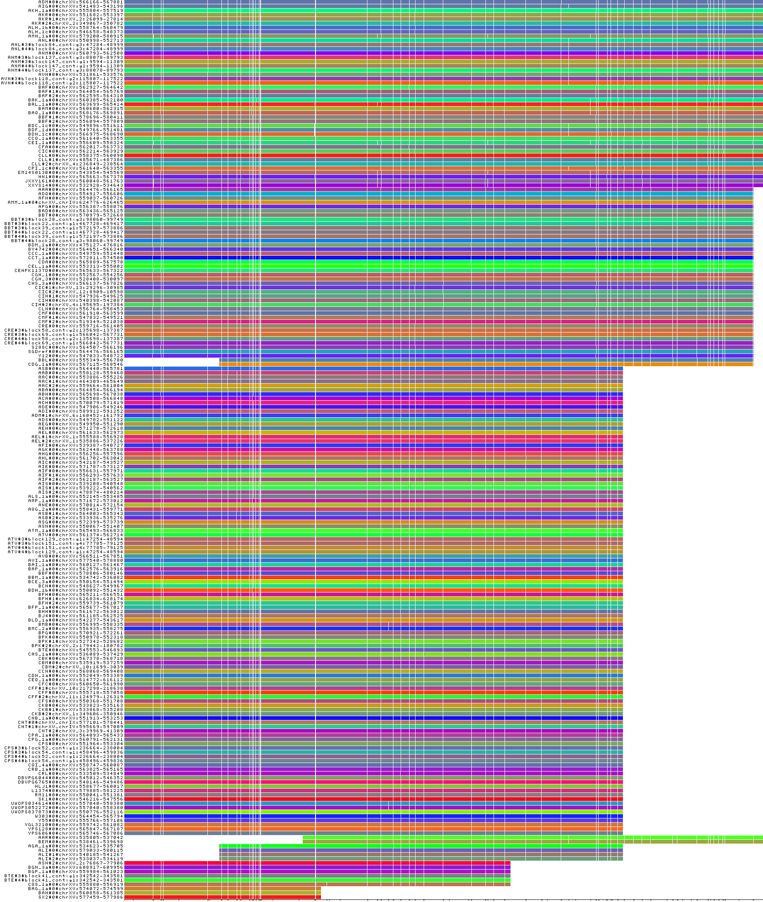

`--syng-extension 1000`

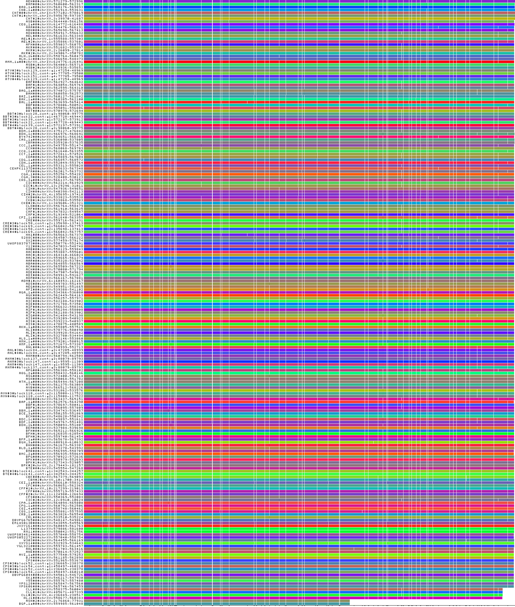

</details>

Basic GFA counts are still useful:

```bash
for g in graphs/*.gfa; do
    printf "%s\tS=%s\tL=%s\tW=%s\tP=%s\n" \
        "$g" \
        "$(grep -c '^S' "$g")" \
        "$(grep -c '^L' "$g")" \
        "$(grep -c '^W' "$g")" \
        "$(grep -c '^P' "$g")"
done
```

### Built-in rendering

Recent `impg query` also has built-in graph rendering:

```bash
impg query \
    -a yeast235.syng \
    --sequence-files yeast235.agc \
    -r SGDref#0#chrXV:564476-566191 \
    -d 1k \
    -o gfa:poa \
    --syng-extension 1000 \
    -O graphs/ADE2.rendered \
    --render-graph \
    --render-graph-output figures/ADE2.rendered.png
```

This uses `gfalook` through `impg`. If it fails with an error about `gfalook`, use odgi rendering instead and tell an instructor. That failure means the renderer is missing from `PATH`, not that the graph query failed.

<details>
<summary>Output: built-in gfalook rendering</summary>

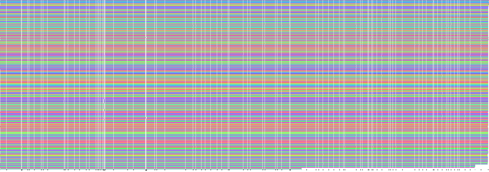

</details>

### Compare graph engines

For this practical, compare three graph outputs:

- `gfa:poa`: rebuilds a local sequence graph from selected intervals using POA;
- `gfa:syng`: emits a graph directly from the syng syncmer representation;
- `gfa:pggb`: runs the pggb-like local graph path inside `impg`, using the FastGA helper programs and graph smoothing.

Build POA, syng, and pggb versions for ADE2:

```bash
impg query \
    -a yeast235.syng \
    --sequence-files yeast235.agc \
    -r SGDref#0#chrXV:564476-566191 \
    -d 1k \
    -o gfa:poa \
    --syng-extension 1000 \
> graphs/ADE2.poa.ext1000.gfa

impg query \
    -a yeast235.syng \
    --sequence-files yeast235.agc \
    -r SGDref#0#chrXV:564476-566191 \
    -d 1k \
    -o gfa:syng \
    --syng-extension 1000 \
> graphs/ADE2.syng.ext1000.gfa

impg query \
    -a yeast235.syng \
    --sequence-files yeast235.agc \
    -r SGDref#0#chrXV:564476-566191 \
    -d 1k \
    -o gfa:pggb \
    --syng-extension 1000 \
> graphs/ADE2.pggb.ext1000.gfa

scripts/odgi_viz_gfas.sh \
    graphs/ADE2.poa.ext1000.gfa \
    graphs/ADE2.syng.ext1000.gfa \
    graphs/ADE2.pggb.ext1000.gfa

cat results/odgi_graph_stats.tsv
```

The three graphs are not expected to be identical. They are different graph constructions over the same set of query-selected sequences. That is the point of the comparison.

<details>
<summary>Output: ADE2 graph engine comparison</summary>

`gfa:poa`


`gfa:syng`

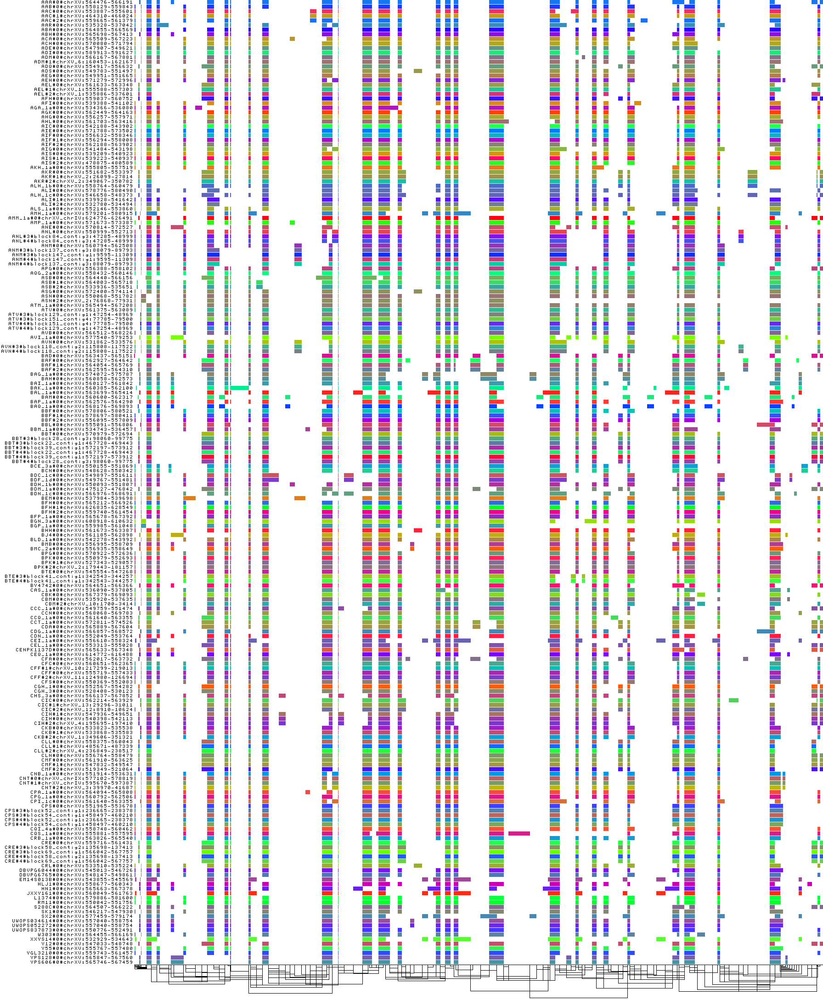

`gfa:pggb`

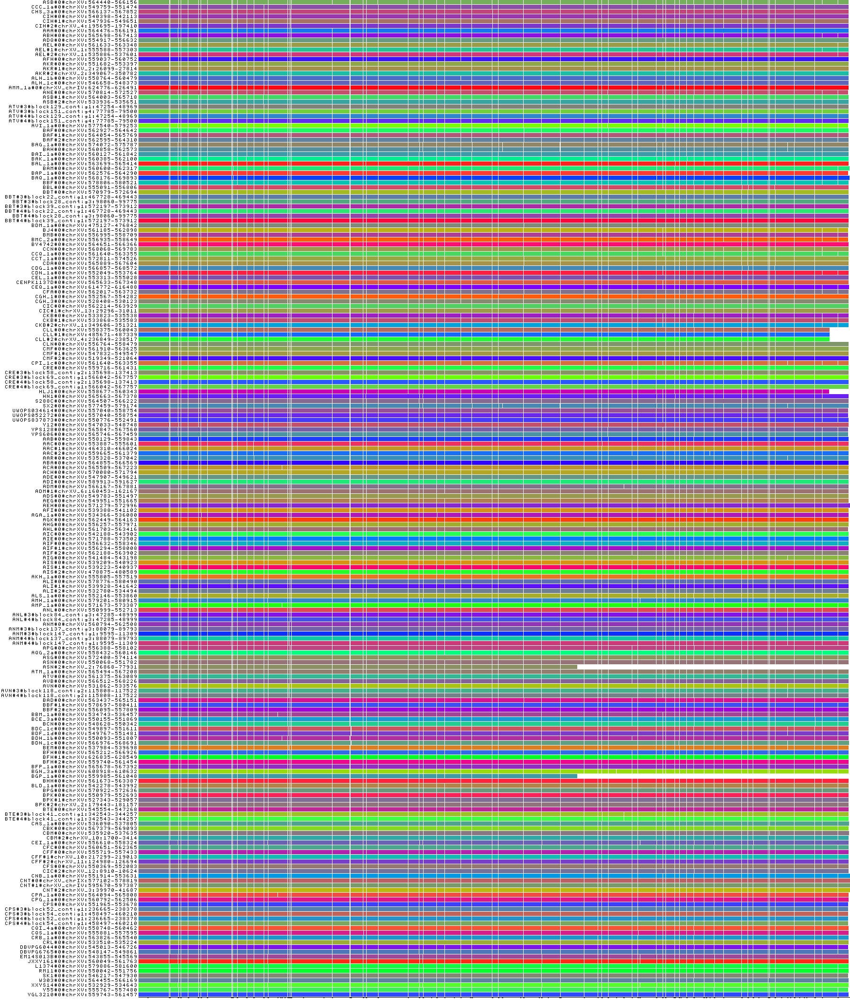

</details>

<details>
<summary>Observed answer on this Vesuvio workspace</summary>

For `SGDref#0#chrXV:564476-566191`, all three graph engines collected about 210 paths. The ADE2 odgi stats were:

| Graph | Nodes | Edges | Paths | Steps |
|---|---:|---:|---:|---:|
| `ADE2.poa.ext1000` | 280 | 371 | 210 | 38748 |
| `ADE2.syng.ext1000` | 309 | 389 | 210 | 13402 |
| `ADE2.pggb.ext1000` | 301 | 392 | 210 | 43158 |

The syng graph has far fewer path steps here because it is a direct syncmer-derived representation, not a POA/pggb-style sequence graph.

</details>

### VCF output from a local graph

The same local graph can be decomposed into VCF with `impg gfa2vcf`. This is most useful on a small, mostly collinear control graph.

```bash
impg query \
    -a yeast235.syng \
    --sequence-files yeast235.agc \
    -r AAA#0#chrXV:564476-566191 \
    -d 1k \
    -o gfa:poa \
    --syng-extension 1000 \
> graphs/ADE2.for_vcf.poa.ext1000.gfa

impg gfa2vcf \
    -g graphs/ADE2.for_vcf.poa.ext1000.gfa \
    -r SGDref#0#chrXV:564476-566191 \
    -o results/ADE2.for_vcf.poa.ext1000.vcf

grep -vc '^#' results/ADE2.for_vcf.poa.ext1000.vcf
head -40 results/ADE2.for_vcf.poa.ext1000.vcf
```

This is cutting-edge graph-derived variant calling. The reference path name has to be present in the GFA. Here the `AAA` query pulls in the matching `SGDref` path, which gives `gfa2vcf` a clear reference. If VCF output fails on a larger or repeat-rich graph, keep the GFA and inspect the graph first. For example, `CUP1` is biologically interesting but much harder to decompose cleanly than `ADE2`.

<details>
<summary>Observed answer on this Vesuvio workspace</summary>

The ADE2 POA graph produced 92 VCF records in this run. The VCF is useful as a compact summary, but it is not a replacement for looking at the graph when the locus is repetitive or structurally complex.

</details>

### Graph gallery: five interesting loci

Build a small graph panel for five pangenome-flavored loci plus ADE2 as a control:

```bash
scripts/query_locus_graphs.sh
scripts/odgi_viz_gfas.sh graphs/*.gfa
```

This writes:

- GFA files in `graphs/`;
- odgi binary graphs (`*.og`) in `graphs/`;
- PNG renderings in `figures/`;
- graph size tables in `results/locus_graph_gfa_counts.tsv` and `results/odgi_graph_stats.tsv`.

You can also copy any `*.gfa` file to your laptop and open it in Bandage for interactive inspection. That is often the fastest way to sanity-check a confusing local graph.

Inspect the size table:

```bash
column -t results/odgi_graph_stats.tsv
```

<details>
<summary>Output: graph gallery renderings</summary>

ADE2 control:


Pangenome-flavored loci:

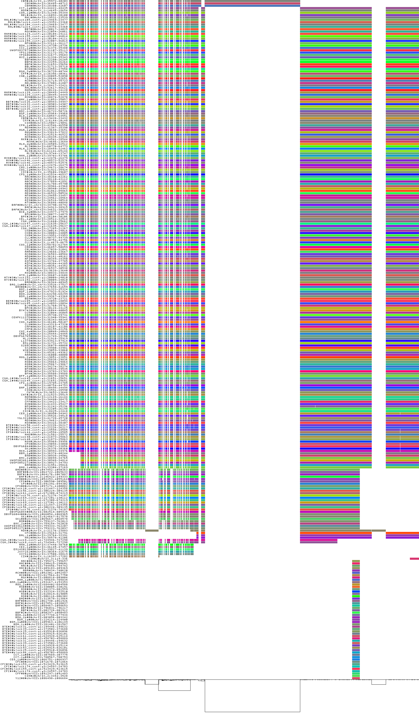
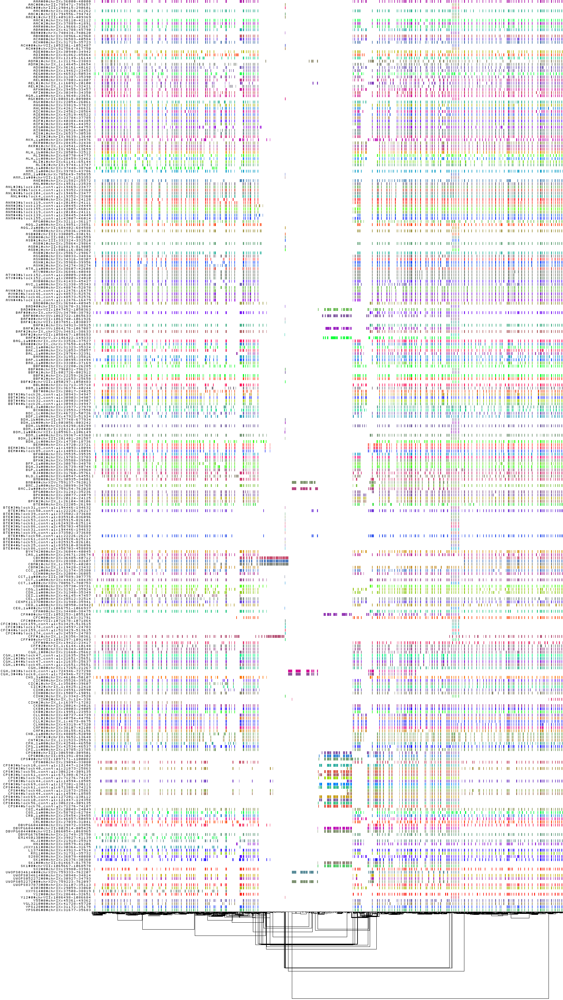
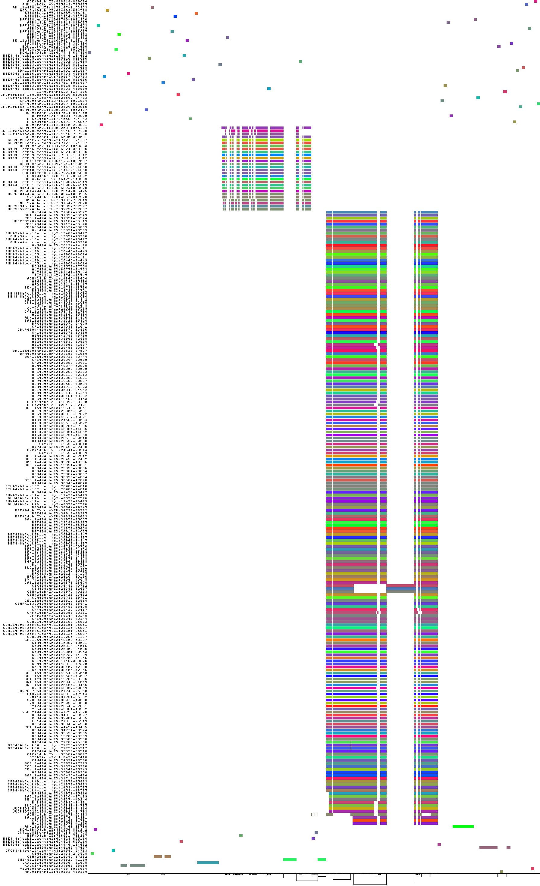
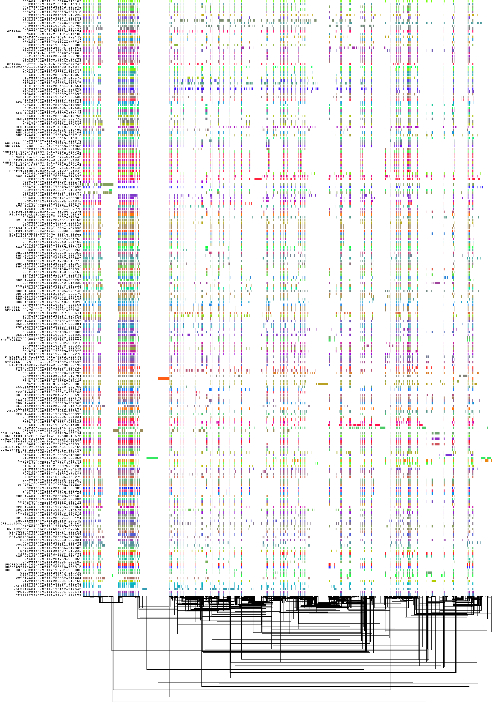
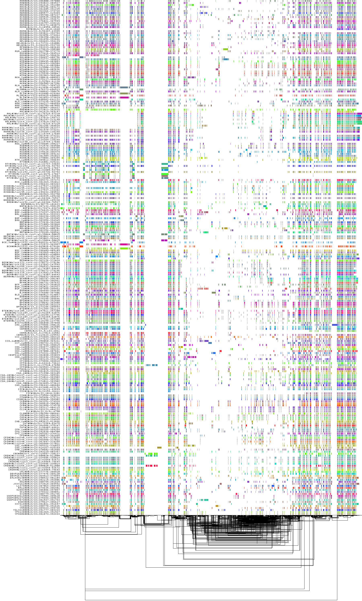
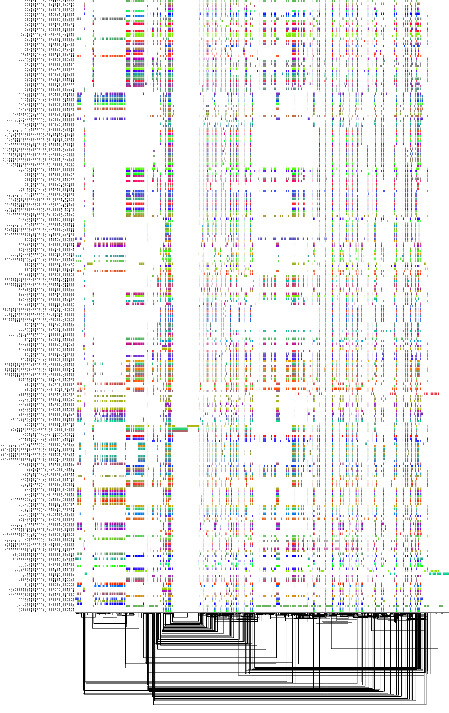
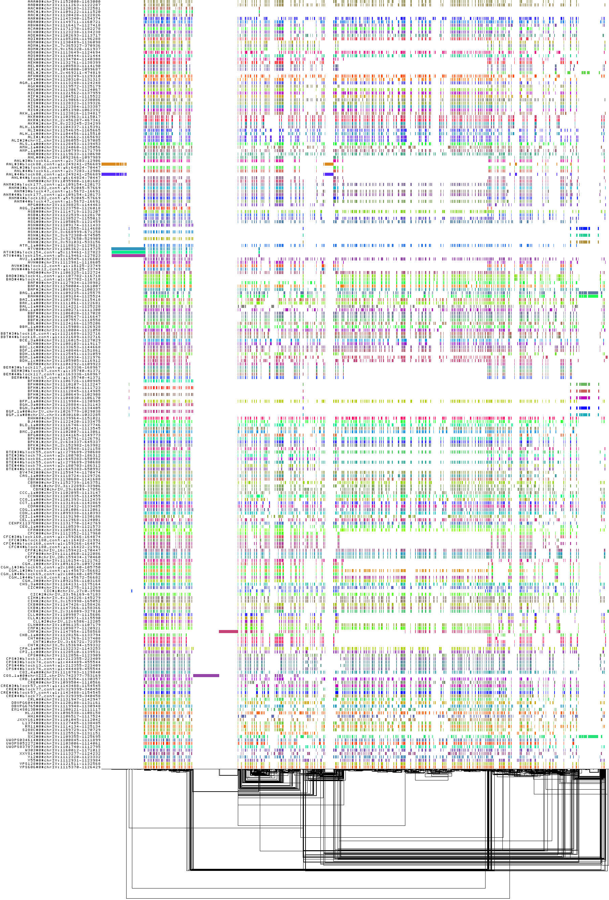

</details>

The panel includes:

| Label | Region | Why it is interesting |
|---|---|---|
| ADE2 | `SGDref#0#chrXV:564476-566191` | core-gene control |
| CUP1 | `SGDref#0#chrVIII:210000-216000` | tandem copy-number variation |
| SUC2 | `SGDref#0#chrIX:36000-40000` | subtelomeric sugar metabolism |
| FLO11 | `SGDref#0#chrIX:386000-397000` | repeat-rich flocculin |
| ENA1 | `SGDref#0#chrIV:532000-540000` | salt-tolerance array behavior |
| HXT6/HXT7 | `SGDref#0#chrIV:1152000-1163000` | duplicated glucose transporter region |

For CUP1, the helper also builds a parameter sweep:

```bash
ls graphs/CUP1*.gfa
ls figures/CUP1*.odgi.png
grep '^graphs/CUP1' results/odgi_graph_stats.tsv | column -t
```

<details>
<summary>Output: CUP1 parameter sweep renderings</summary>

Extension sweep:

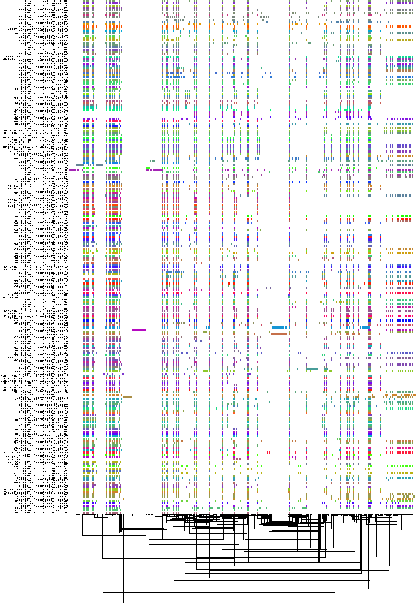

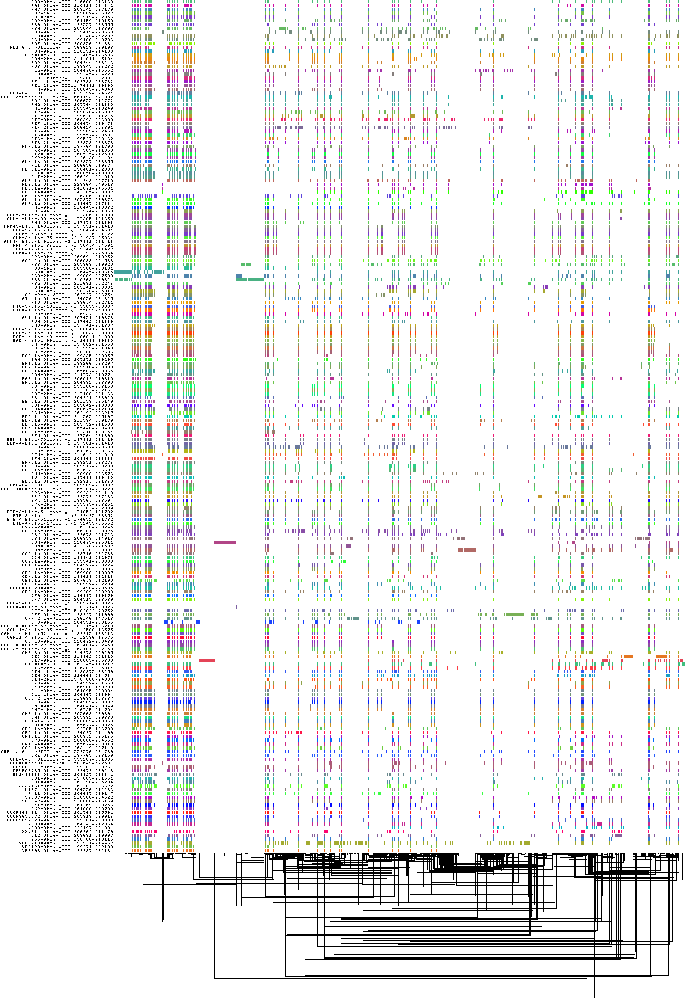

Seed filtering:

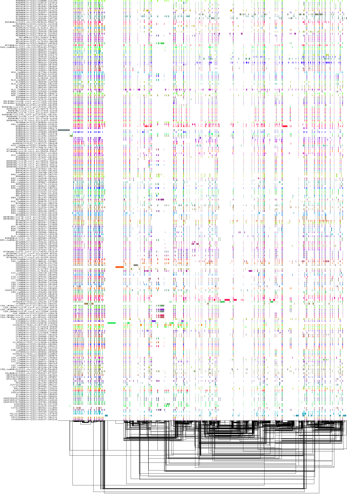
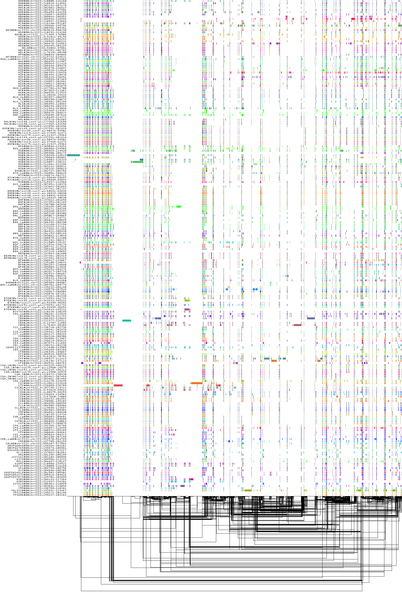

Walk-anchor sensitivity:

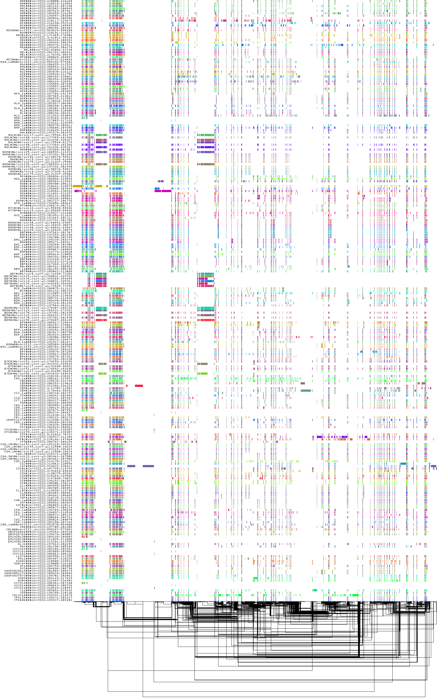
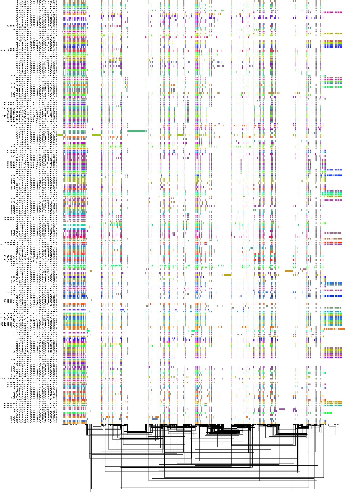

</details>

Important parameters to compare:

- `--syng-extension`: source-side lookup extension. In the helper this is tested at 0, 1000, and 5000 bp.
- `--syng-seed-drop-top-fraction`: drops the most frequent query-local syncmer seeds before locating hits. This matters in repetitive loci.
- `--syng-seed-walk-anchors`: controls how many consecutive syncmers are required for a bounded exact GBWT walk seed. Smaller values are more sensitive and can collect more intervals; larger values are stricter.

<details>
<summary>Observed answer on this Vesuvio workspace</summary>

The CUP1 graphs changed with parameter settings. For example, `CUP1.syng.walk3` collected more paths and steps than `CUP1.syng.walk7`, while `CUP1.syng.ext0`, `ext1000`, and `ext5000` changed node/edge counts and total graph length. FLO11 produced the largest graph in the small panel, consistent with its repeat-rich biology.

The ADE2 and SUC2 examples also include `poa`, `syng`, and `pggb` graph outputs. In this run, SUC2 had the same 290 paths in all three outputs, but very different graph sizes: `SUC2.syng.ext1000` had 2471 nodes and 41173 path steps, while `SUC2.pggb.ext1000` had 2735 nodes and 264318 path steps.

</details>

## 5. Use the GFF to choose better pangenome loci

ADE2 is a good control, but not a good pangenome story. Use the GFF to find accessory, copy-number, repeat-length, or subtelomeric loci.

```bash
zcat yeast235.gff.gz \
| awk -F '\t' '$1 ~ /^SGDref#0#/ && $3=="gene" && $9 ~ /gene=(CUP1|SUC2|FLO11|FLO1|FLO5|FLO9|ENA1|HXT6|HXT7|MAL[0-9]*|GAL2)/ {print $1,$4,$5,$7,$9}' OFS='\t' \
> results/interesting_sgdref_genes.tsv

cut -f 1-4 results/interesting_sgdref_genes.tsv
```

Good candidates:

| Locus | Reference coordinate | Variation to look for |
|---|---:|---|
| CUP1 | `SGDref#0#chrVIII:210000-216000` | copy-number variation in a tandem array |
| SUC2 | `SGDref#0#chrIX:36000-40000` | subtelomeric sugar metabolism, PAV in the broader SUC family |
| FLO1 | `SGDref#0#chrI:200000-211000` | flocculin, subtelomeric/repeat-rich |
| FLO5 | `SGDref#0#chrVIII:522000-532000` | flocculin, repeat variation |
| FLO11 | `SGDref#0#chrIX:386000-397000` | intragenic repeat-length variation |
| ENA1 | `SGDref#0#chrIV:532000-540000` | salt-tolerance copy-number/array behavior |
| HXT6/HXT7 | `SGDref#0#chrIV:1152000-1163000` | duplicated glucose transporter region |
| MAL loci | chrII/chrVII subtelomeres | maltose metabolism, subtelomeric variation |

Pick one locus and query it. Example: CUP1.

```bash
impg query \
    -a yeast235.syng \
    --sequence-files yeast235.agc \
    -r SGDref#0#chrVIII:210000-216000 \
    -d 1k \
    -o bed \
> results/CUP1.syng.bed

cut -f 1 results/CUP1.syng.bed \
| cut -f 1,3 -d '#' \
| sort \
| uniq -c \
| sort -nr \
| head -30
```

Then extract nearby annotations:

```bash
zcat yeast235.gff.gz \
| awk -F '\t' '$1=="SGDref#0#chrVIII" && $4 <= 220000 && $5 >= 205000 {print}' \
> results/CUP1.SGDref.annotations.gff
```

This is where you can reuse the gene-arrow plotting ideas from earlier activities: put the query hits and local genes on the same coordinate plot. The interesting question is whether the sequence hits line up with gene content, repeated genes, or subtelomeric/repeat features.

### Inject gene features into an odgi graph

Another useful trick is to turn GFF features into BED intervals over a graph path, inject them as new paths, and render the graph again. Here we use the CUP1 graph and the `SGDref#0#chrVIII:210000-216103` path.

The BED coordinates are local to the graph path, so we subtract the path start (`210000`) from the SGDref GFF coordinates.

```bash
zcat yeast235.gff.gz \
| awk -F '\t' -v path='SGDref#0#chrVIII:210000-216103' -v region_start=210000 -v region_end=216103 '
    BEGIN { OFS="\t" }
    $1=="SGDref#0#chrVIII" && $3=="gene" && $4 <= region_end && $5 >= region_start {
        start = $4 - 1 - region_start
        end = $5 - region_start
        if (start < 0) start = 0
        if (end > region_end - region_start) end = region_end - region_start
        name = "feature"
        n = split($9, attrs, ";")
        for (i = 1; i <= n; i++) {
            split(attrs[i], kv, "=")
            if (kv[1] == "gene" && kv[2] != "") { name = kv[2]; break }
            if (kv[1] == "Name" && kv[2] != "") { name = kv[2] }
        }
        print path, start, end, name
    }' \
> results/CUP1.SGDref.genes.odgi.bed

odgi inject \
    -i graphs/CUP1.syng.ext1000.og \
    -b results/CUP1.SGDref.genes.odgi.bed \
    -o graphs/CUP1.syng.ext1000.with_genes.og \
    -t 4
```

Render the injected graph. The first rendering keeps all graph paths; the focused rendering shows only the SGDref path and injected gene paths.

```bash
odgi viz \
    -i graphs/CUP1.syng.ext1000.with_genes.og \
    -o figures/CUP1.syng.ext1000.with_genes.odgi.png \
    -x 1800 -y 900 -a 2

{
    echo 'SGDref#0#chrVIII:210000-216103'
    cut -f 4 results/CUP1.SGDref.genes.odgi.bed
} > results/CUP1.SGDref.genes.paths_to_display.txt

odgi viz \
    -i graphs/CUP1.syng.ext1000.with_genes.og \
    -p results/CUP1.SGDref.genes.paths_to_display.txt \
    -o figures/CUP1.syng.ext1000.with_genes.focus.odgi.png \
    -x 1800 -y 420 -a 16 -c 24
```

<details>
<summary>Output: CUP1 graph with injected gene paths</summary>

All paths:

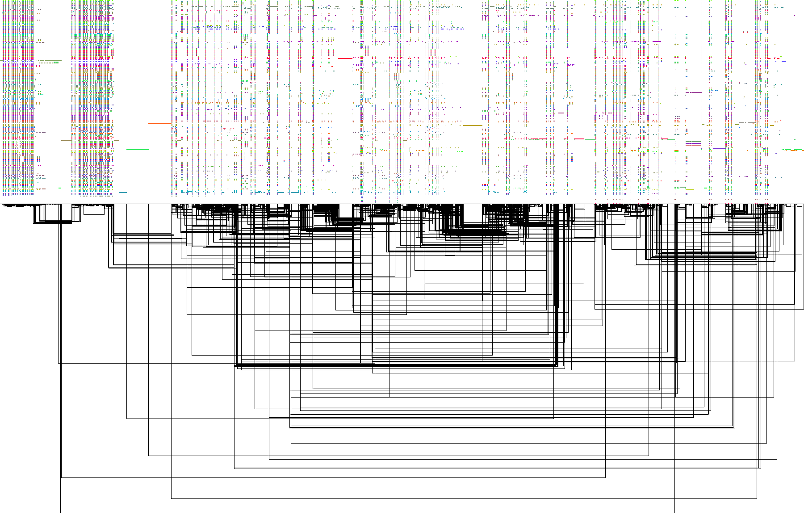

Focused view:

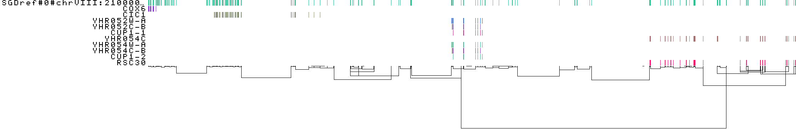

</details>

This is a deliberately simple feature overlay. A more polished analysis would keep feature types, strand, and colors in a separate track; here the goal is to show that graph path coordinates can be connected back to gene annotations.

### Question

For your chosen locus, is the syng result mostly same-chromosome hits, multi-chromosome hits, fragmented contig hits, or a mixture?

<details>
<summary>Answer</summary>

There is no single correct answer because each locus teaches a different flavor of variation. CUP1 should lead you toward copy number and local tandem structure. FLO genes should lead you toward repeat-length and subtelomeric complexity. SUC/MAL loci should lead you toward subtelomeric presence/absence and duplicated sugar metabolism genes.

</details>

## 6. Pseudohomolog region experiment: scan reference windows

Yue et al. 2017 described pseudohomolog regions (PHRs) in yeast subtelomeres, where different chromosome ends share homologous sequence blocks. We can make a simple version of that analysis by asking:

> In each 10 kb SGDref window, how many distinct query chromosome labels are found?

This is a deliberately quick-and-dirty statistic. To keep the plot interpretable, the helper scripts keep only clean canonical chromosome labels: `chrI` through `chrXVI`, plus `chrMT`. They drop fused, fragmented, or block-style labels such as `chrV_2`, `chrV_chrX`, and `block84_contig3`. A more careful analysis would model those labels instead of throwing them away, but for this tutorial the conservative filter makes the pseudohomolog region signal much easier to see.

The scripts report two counts:

- `n_canonical_query_chromosomes`: clean chromosome labels seen in the window;
- `n_other_canonical_query_chromosomes`: clean chromosome labels excluding the reference chromosome. This second column is the main pseudohomolog-region signal.

### 6A. Fast reference-based scan from PAF

Run this for chromosome V:

```bash
awk \
    -v window=10000 \
    -v only_chrom='SGDref#0#chrV' \
    -f scripts/paf_window_chrom_counts.awk \
    yeast235.vs.SGDref.paf \
> results/chrV.paf.window_chrom_counts.tsv

head results/chrV.paf.window_chrom_counts.tsv
tail results/chrV.paf.window_chrom_counts.tsv
```

Plot it:

```bash
Rscript scripts/plot_window_counts.R \
    results/chrV.paf.window_chrom_counts.tsv \
    figures/chrV.paf.window_chrom_counts.png \
    'PAF scan: chrV other canonical chromosomes'
```

<details>
<summary>Output: PAF pseudohomolog region scan</summary>

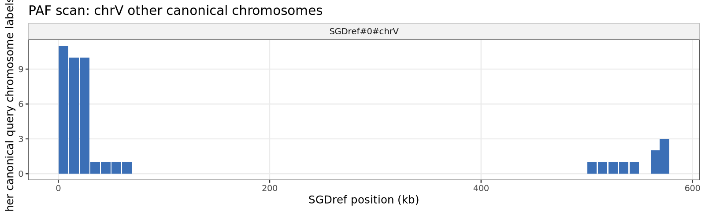

</details>

For a whole-genome scan, omit `only_chrom`:

```bash
awk \
    -v window=10000 \
    -f scripts/paf_window_chrom_counts.awk \
    yeast235.vs.SGDref.paf \
> results/all_SGDref.paf.window_chrom_counts.tsv
```

For a quick multi-chromosome panel, scan a few chromosomes and plot them together:

```bash
{
    first=1
    for chrom in SGDref#0#chrI SGDref#0#chrV SGDref#0#chrVIII SGDref#0#chrIX SGDref#0#chrXV; do
        awk -v window=10000 -v only_chrom="$chrom" \
            -f scripts/paf_window_chrom_counts.awk \
            yeast235.vs.SGDref.paf \
        | awk -v first="$first" 'first || NR > 1 {print}'
        first=0
    done
} > results/selected_SGDref.paf.window_chrom_counts.tsv

Rscript scripts/plot_window_counts.R \
    results/selected_SGDref.paf.window_chrom_counts.tsv \
    figures/selected_SGDref.paf.window_chrom_counts.png \
    'PAF scan: selected SGDref chromosomes, other canonical chromosomes'
```

<details>
<summary>Output: selected reference chromosome PAF scan</summary>

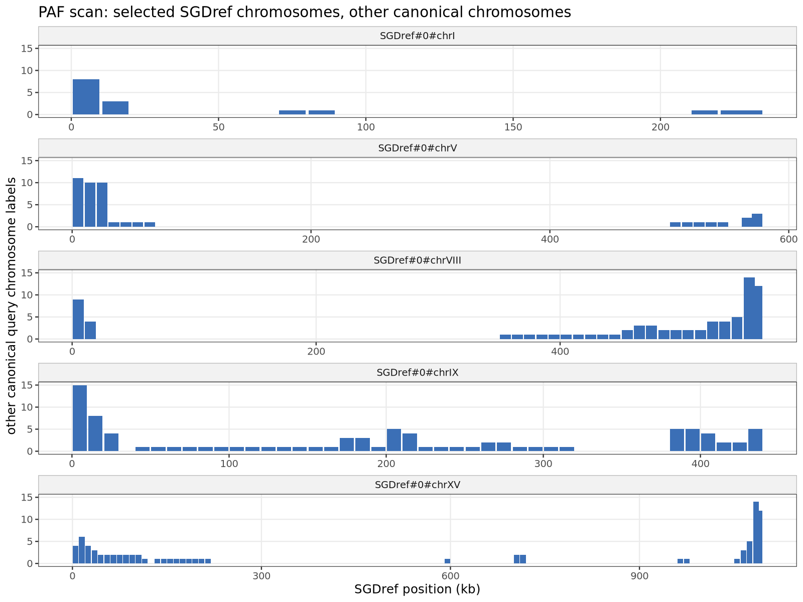

</details>

### 6B. Syng scan

Run the same idea through syng. This is slower because it runs one `impg query` per window. For the practical, run chrV if you have time; otherwise run selected high-interest windows by hand.

```bash
scripts/syng_window_chrom_counts.sh \
    SGDref#0#chrV \
    10000 \
    1k \
    yeast235.syng \
    yeast235.agc \
    yeast235.fa.gz.fai \
> results/chrV.syng.window_chrom_counts.tsv
```

Plot it:

```bash
Rscript scripts/plot_window_counts.R \
    results/chrV.syng.window_chrom_counts.tsv \
    figures/chrV.syng.window_chrom_counts.png \
    'Syng scan: chrV other canonical chromosomes'
```

<details>
<summary>Output: syng pseudohomolog region scan</summary>

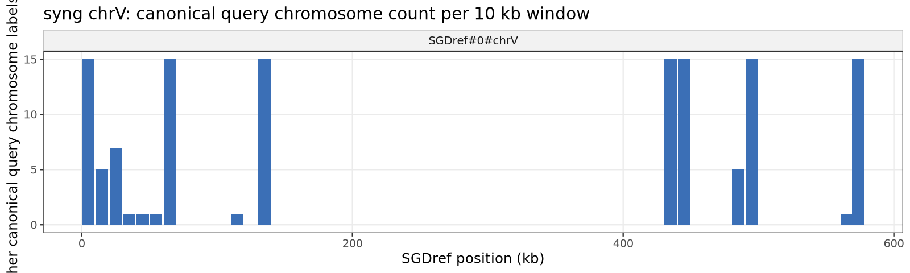

</details>

Compare the two scans:

```bash
paste \
    results/chrV.paf.window_chrom_counts.tsv \
    results/chrV.syng.window_chrom_counts.tsv \
| awk 'NR==1 {print "chrom\tstart\tend\tpaf_count\tpaf_other_count\tsyng_count\tsyng_other_count"; next}
       {print $1,$2,$3,$4,$5,$9,$10}' OFS='\t' \
> results/chrV.paf_vs_syng.window_chrom_counts.tsv

sort -k7,7nr results/chrV.paf_vs_syng.window_chrom_counts.tsv | head -20
```

Plot the comparison:

```bash
Rscript scripts/plot_paf_vs_syng.R \
    results/chrV.paf_vs_syng.window_chrom_counts.tsv \
    figures/chrV.paf_vs_syng.window_chrom_counts.png \
    'PAF vs syng scan: chrV other canonical chromosomes'
```

<details>
<summary>Output: PAF vs syng pseudohomolog region scan</summary>

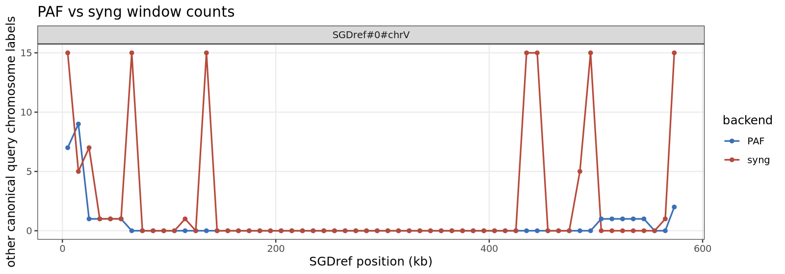

</details>

### Question

Where are the highest-count windows? Are they close to telomeres, known subtelomeric elements, or genes from your GFF search?

<details>
<summary>Answer</summary>

On this dataset, the left end of chrV still shows high signal after filtering to clean chromosome labels. That is expected because the first 10 kb contains subtelomeric Y-prime and X element sequence. Most internal windows collapse to only chrV, which is what we want. Syng may still produce internal spikes; treat those as candidates for duplicated sequence, transitive syng hits, or parameters that are too permissive for the question.

</details>

## 7. Connect pseudohomolog region windows to subtelomeric annotations

Extract SGDref subtelomeric features:

```bash
zcat yeast235.gff.gz \
| awk -F '\t' '$1 ~ /^SGDref#0#/ && $3 ~ /X_element|Y_prime|subtelomere/ {print}' \
> results/SGDref.subtelomeric_features.gff

head results/SGDref.subtelomeric_features.gff
```

For chromosome V:

```bash
awk -F '\t' '$1=="SGDref#0#chrV"' results/SGDref.subtelomeric_features.gff
```

Now compare these feature coordinates to your high-count windows.

<details>
<summary>Answer</summary>

For `SGDref#0#chrV`, the GFF contains a left telomeric Y-prime element from approximately 1-6278 and an X element around 6279-6473. It also contains right telomeric X/Y-prime features near the chromosome end. These are exactly the kinds of regions where a reference window can match many chromosome ends.

</details>

## 8. Suggested 90-minute path

1. Setup and inspect names: 10 minutes.
2. Run two syng BED queries: chrV subtelomere and ADE2: 10 minutes.
3. Generate one local POA GFA for ADE2 or your chosen locus: 15 minutes.
4. Choose one pangenome locus from the GFF: 15 minutes.
5. Run the PAF window scan for chrV and plot it: 10 minutes.
6. Start the syng window scan for chrV, or run only selected windows if time is tight: 15 minutes.
7. Compare PAF vs syng, then connect high-count windows to GFF subtelomeric features: 15 minutes.

## 9. Bonus extensions

Run more chromosomes:

```bash
for chrom in SGDref#0#chrI SGDref#0#chrV SGDref#0#chrVIII SGDref#0#chrIX; do
    awk -v window=10000 -v only_chrom="$chrom" \
        -f scripts/paf_window_chrom_counts.awk \
        yeast235.vs.SGDref.paf \
    > results/${chrom##*#}.paf.window_chrom_counts.tsv
done
```

Try smaller or larger windows:

```bash
for w in 5000 10000 25000; do
    awk -v window="$w" -v only_chrom='SGDref#0#chrV' \
        -f scripts/paf_window_chrom_counts.awk \
        yeast235.vs.SGDref.paf \
    > results/chrV.paf.${w}bp_windows.tsv
done
```

Try stricter or looser syng distance values:

```bash
for d in 100 500 1k 5k; do
    impg query \
        -a yeast235.syng \
        --sequence-files yeast235.agc \
        -r SGDref#0#chrV:0-10000 \
        -d "$d" \
        -o bed \
    | cut -f 1 \
    | cut -f 3 -d '#' \
    | awk '$0 ~ /^chr(I|II|III|IV|V|VI|VII|VIII|IX|X|XI|XII|XIII|XIV|XV|XVI|MT)$/' \
    | sort | uniq -c | sort -nr \
    > results/chrV_0_10000.syng.d${d}.chrom_counts.txt
done
```

Use a Ty element as a seed. This is a good stress test because Ty/LTR sequence is repetitive and often participates in structural variation. Do not start by making a graph from this; first measure how much sequence comes back.

The example below uses the annotated S288C/SGDref Ty5 element at `SGDref#0#chrIII:1179-4322`. This is not a huge element: the GFF calls it the only near-full-length Ty5 in S288C, and nonfunctional. It is still a useful seed because it sits right next to the left chrIII telomere and overlaps Ty-related pseudogene fragments.

```bash
zcat yeast235.gff.gz \
| awk -F '\t' '$1=="SGDref#0#chrIII" && $3=="LTR_retrotransposon" && $9 ~ /Ty5/ {print}' \
> results/SGDref.chrIII.Ty5.gff

impg query \
    -a yeast235.syng \
    --sequence-files yeast235.agc \
    -r SGDref#0#chrIII:1179-4322 \
    -d 0 \
    -o bed \
> results/Ty5_chrIII_1179_4322.syng.d0.bed

wc -l results/Ty5_chrIII_1179_4322.syng.d0.bed

cut -f 1 results/Ty5_chrIII_1179_4322.syng.d0.bed \
| cut -f 3 -d '#' \
| sort | uniq -c | sort -nr \
| head -30
```

Now repeat with the conservative canonical-chromosome filter:

```bash
cut -f 1 results/Ty5_chrIII_1179_4322.syng.d0.bed \
| cut -f 3 -d '#' \
| awk '$0 ~ /^chr(I|II|III|IV|V|VI|VII|VIII|IX|X|XI|XII|XIII|XIV|XV|XVI|MT)$/' \
| sort | uniq -c | sort -nr
```

<details>
<summary>Observed answer on this Vesuvio workspace</summary>

The chrIII Ty5 seed returned 192 BED intervals across 134 sequence paths with `-d 0`. Most clean labels were chrIII, but the query also picked up canonical hits to chrXIII, chrVI, chrVIII, chrII, chrXV, chrXIV, chrXI, and chrVII, plus fused and block-style labels. With `-d 1k`, nearby intervals merge down to 137 BED rows. This is exactly why Ty elements are interesting, and also why a single local graph can become hard to interpret quickly.

</details>

## Conclusions

1. Reference-based PAF scans are fast and useful, but they are constrained by what aligns cleanly to the reference.
2. Syng queries can reveal broader all-to-all relationships, especially in repetitive or subtelomeric regions, but they need careful parameter checks.
3. Core genes such as ADE2 are useful controls; accessory/repetitive loci such as CUP1, FLO, SUC, MAL, ENA, and HXT regions are better pangenome teaching examples.
4. Pseudohomolog regions are visible as windows where one reference interval recruits many chromosome labels, especially near subtelomeres.
5. The GFF is essential. Sequence hits become much more interpretable when you overlay gene arrows, subtelomeric elements, and known accessory loci.
